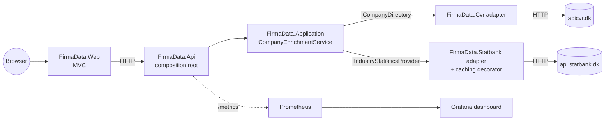

# FirmaData

A service that enriches Danish company data with industry statistics. It puts two public data
sources — the CVR API and Danmarks Statistik — behind one simplified REST API, plus an MVC
frontend that consumes that API like any other client would.

C# / .NET 8, Ports & Adapters (hexagonal) architecture.



<details>
<summary>Diagram not rendering? Plain-text fallback</summary>

```
Browser
   |
   v
FirmaData.Web (MVC)
   |
   | HTTP
   v
FirmaData.Api (composition root) --- /metrics ---> Prometheus ---> Grafana dashboard
   |
   v
FirmaData.Application (CompanyEnrichmentService)
   |
   +-- ICompanyDirectory --------------> FirmaData.Cvr adapter ---------------------> apicvr.dk (HTTP)
   |
   +-- IIndustryStatisticsProvider ----> FirmaData.Statbank adapter                -> api.statbank.dk (HTTP)
                                          (+ caching decorator)
```

</details>

## Start without Docker - API and Web access only

API:
```
cd solution\src\Backend\FirmaData.Api
dotnet run
```

Web:
```
cd solution\src\Frontend\FirmaData.Web
dotnet run
```

## Start using Docker

```bash
docker compose up --build
```

| Service | URL |
| --- | --- |
| UI (search a company) | http://localhost:8090/ |
| Swagger UI | http://localhost:8080/swagger |
| Prometheus | http://localhost:9090/ |
| Grafana dashboard | http://localhost:3000/ |

## Start using Docker - auto-open browser and tabs

On Windows:
* [`web/run.bat`](web/run.bat) does the same and opens all four tabs once the API is
healthy;
* [`web/shutdown.bat`](web/shutdown.bat) stops the stack again.

## Sample calls

Company `LB Forsikring` with CVR number `16500836` is used for samples and tests throughout the project:

```bash
curl -s "http://localhost:8080/api/v1/companies/16500836?year=2022"
curl -s "http://localhost:8080/api/v1/companies?name=LB%20Forsikring"
```

## Running the test suite without the live smoketest ("Category", "Live"):

```bash
dotnet test solution/FirmaData.sln --filter "Category!=Live"
```

The filter excludes a smoke-test class that calls the real upstream APIs. See
[testing](docs/reference/testing.md).

## Repository layout

| Path | What's in it |
| --- | --- |
| [solution/src/Backend/](solution/src/Backend/) | Domain, Application, the two adapters, and the API host |
| [solution/src/Frontend/](solution/src/Frontend/) | `FirmaData.Web`, the MVC frontend |
| [solution/tests/](solution/tests/) | Test projects, one per production project |
| [ops/](ops/) | Prometheus and Grafana provisioning mounted by Docker Compose |
| [tools/](tools/) | Circuit-breaker test harness |
| [web/](web/) | Windows launcher scripts for the Docker stack |
| [.github/workflows/](.github/workflows/) | CI and live smoke test pipelines |
| [docs/](docs/) | Documentation, including Architectural Decision Records under `reference/adr/` |

## Documentation

Full index, one document per topic (getting started, architecture, API reference,
configuration, testing, design decisions, trade-offs, gotchas, CI/CD, microservices guides):
[docs/README.md](docs/README.md).
