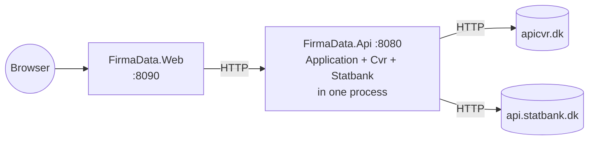
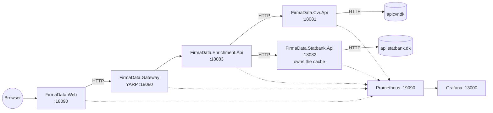

# From modular monolith to microservices

A step-by-step guide for splitting FirmaData's modular monolith into five independently
deployable services behind an API gateway, orchestrated with Docker Compose, communicating over
synchronous HTTP/REST.

This is the topology [`docs/reference/adr/0001-modular-monolith-topology.md`](../reference/adr/0001-modular-monolith-topology.md)
deliberately *did not* choose. ADR-0001 closes with the claim that promoting the adapters to
separate services later "is a matter of adding a Dockerfile and an HTTP-facing host around the
existing adapter — the contracts at the port boundary do not change." This guide is that claim,
executed in full.

**Status: documentation only.** Nothing in this guide has been implemented in the repository. No
`solution_microservices/` tree, no `docker-compose.microservices.yml`, no gateway project exists
yet. Every command and file below is written to be followed as-is when the split is actually
wanted; the sequel [`monolith-microservice_production-level.md`](monolith-microservice_production-level.md)
continues from Phase 12 and adds Redis, messaging, tracing, auth, secrets, persistence and
hardening on top of the result.

---

## 1. Ground rules

Four rules shape every phase below. They exist so that the guide can be stopped at the end of any
phase without leaving anything broken.

1. **The monolith is never touched.** The microservice variant is built in a *separate solution
   tree*, `solution_microservices/`, next to the existing `solution/`. `docker compose up --build`
   at the repository root keeps working exactly as it does today, throughout and after.
2. **Both stacks can run at the same time.** Different compose project names, different host
   ports. This is not a convenience — it is the verification mechanism: every phase from Phase 5
   onward is checked by diffing the microservice stack's JSON against the monolith's for the same
   request.
3. **Every phase ends buildable and testable.** Each phase closes with an explicit exit criterion
   consisting of a `dotnet build`, a `dotnet test`, and a runtime check. If any of the three
   fails, the phase is not done.
4. **Domain logic is never rewritten.** `FirmaData.Domain`, `FirmaData.Application` and both
   adapter libraries are copied unchanged and stay unchanged. What changes is *where the process
   boundary falls*, nothing else. If you find yourself editing `CompanyEnrichmentService`, stop —
   something has gone wrong.

### Why a separate solution tree, not a folder inside `solution/`

Complete separation, chosen deliberately over sharing one solution:

* **The Docker build context becomes clean.** Each Dockerfile's context is
  `./solution_microservices`. A project reference reaching back into `../solution/...` cannot be
  satisfied inside a container build at all — the parent directory is outside the context. Sharing
  the libraries by reference would force the context up to the repository root and drag `docs/`,
  `docs/`, `plans/` and `.git/` into every image build.
* **The two topologies can diverge without a migration.** The microservice variant needs
  `ServiceDefaults`, internal contracts, and different resilience budgets. Keeping them in one
  solution means every one of those changes is a change to the monolith's build too.
* **The monolith stays demoable.** The take-home is delivered as a modular monolith. A reviewer
  cloning the repo runs `docker compose up --build` and gets exactly what the README describes.

The cost is real and is stated here rather than hidden: **five libraries exist twice**
(`Domain`, `Application`, `Contracts`, `Cvr`, `Statbank`). Phase 12 covers how that debt is paid
down — either by retiring the monolith or by lifting the shared libraries into NuGet packages.

---

## 2. Start and end state

### Today — modular monolith (2 application containers)



### After this guide — 5 services behind a gateway



### What moves where

| Monolith today | Microservice variant | Why |
| --- | --- | --- |
| `FirmaData.Cvr` (class library, in-process) | Same library, hosted by `FirmaData.Cvr.Api` | Independent scaling and deployment of the master-data path |
| `FirmaData.Statbank` (class library, in-process) | Same library, hosted by `FirmaData.Statbank.Api` | The enrichment source fails independently of CVR; now it also *deploys* independently |
| `CachingIndustryStatisticsProvider` inside the API process | Inside `FirmaData.Statbank.Api` | The cache follows the data it caches. One owner, one invalidation story |
| `FirmaData.Api` (composition root + orchestration + HTTP surface) | `FirmaData.Enrichment.Api` — same controllers, same `CompanyEnrichmentService`, new HTTP-based adapters | The orchestration is the thing worth keeping; only the ports' implementations change |
| — | `FirmaData.Gateway` (YARP) | One public entry point, routing, rate limiting, and a place to put auth later |
| `FirmaData.Web` calls the API directly | Calls the gateway | The frontend stays "just another client" — see ADR-0004 |

**The load-bearing insight:** `CompanyEnrichmentService` depends on `ICompanyDirectory` and
`IIndustryStatisticsProvider`, never on `CvrApiClient` or `StatbankClient`. Swapping an in-process
adapter for an HTTP adapter is therefore a *dependency-injection change*, not a rewrite. The
`ArchitectureTests` that enforce that rule are what make this whole guide a two-week job instead
of a two-month one.

---

## 3. Phase 0 — Prerequisites and a verified baseline

**Goal:** a known-good starting point, and every tool installed before anything is created.

### 3.1 Software

| Software | Version | Why | Check |
| --- | --- | --- | --- |
| .NET SDK | 8.0.423 (pinned by [`global.json`](../../global.json), `rollForward: latestFeature`) | Every project targets `net8.0` | `dotnet --version` |
| Docker Desktop | 4.30+ (Compose v2) | Five images, one compose file. Compose v2 is required for the top-level `name:` key used in Phase 3 | `docker compose version` |
| Git | 2.40+ | Branch per phase | `git --version` |
| `curl` | any | Every verification step in this guide | `curl.exe --version` |
| `jq` | 1.6+ | The parity diffs in Phase 5 and Phase 9 | `jq --version` |

> **PowerShell note.** In Windows PowerShell 5.1, `curl` is an alias for `Invoke-WebRequest`, which
> does *not* accept `-s`, `-f` or `-i`. Every `curl` command in this guide must be typed as
> `curl.exe`. `jq` can be installed with `winget install jqlang.jq`.

Nothing else is needed. No Kubernetes, no service mesh, no message broker — those belong to the
production-level sequel, and adding them here would obscure what the split itself actually costs.

### 3.2 Verify the baseline before changing anything

```powershell
cd d:\System\Work\ApplicationProjects\FirmaData

dotnet build solution/FirmaData.sln --configuration Release
dotnet test  solution/FirmaData.sln --configuration Release --no-build --filter "Category!=Live"

docker compose up --build -d
curl.exe -s "http://localhost:8080/api/v1/companies/16500836?year=2022" | jq .
curl.exe -s  http://localhost:8080/health/ready
docker compose down
```

Record the JSON from that first `curl` — save it, it is the reference payload every later phase is
compared against:

```powershell
docker compose up --build -d
curl.exe -s "http://localhost:8080/api/v1/companies/16500836?year=2022" | jq -S . > baseline-16500836.json
docker compose down
```

### 3.3 Branch

Direct pushes to `main` are blocked by [`.githooks/pre-push`](../../.githooks/pre-push). Work on a
feature branch and open a PR per phase — one PR per phase keeps each reviewable, and each one is
independently revertable because each phase is self-contained.

```powershell
git checkout -b feature/microservices-phase-1
```

**Exit criteria**

- [ ] `dotnet build` and `dotnet test` both green on `main`.
- [ ] All four URLs from the README resolve.
- [ ] `baseline-16500836.json` saved outside the repository (or added to `.gitignore`).

---

## 4. Phase 1 — Fork the solution tree

**Goal:** a second, complete, independently buildable solution at `solution_microservices/` that
still behaves exactly like the monolith. No architecture has changed yet — this phase only creates
somewhere for the split to happen.

Ending the guide here would leave the repository with a redundant but perfectly working copy. That
is intentional: it makes Phase 1 revertable by deleting one directory.

### 4.1 Copy

```powershell
# PowerShell
Copy-Item -Recurse -Path solution -Destination solution_microservices

# Remove build output that came along for the ride
Get-ChildItem solution_microservices -Include bin,obj -Recurse -Directory | Remove-Item -Recurse -Force
```

```bash
# bash equivalent
cp -r solution solution_microservices
find solution_microservices \( -name bin -o -name obj \) -type d -prune -exec rm -rf {} +
```

### 4.2 Rename the solution

```powershell
cd solution_microservices
Rename-Item FirmaData.sln       FirmaData.Microservices.sln
Rename-Item FirmaData.Build.slnf FirmaData.Microservices.Build.slnf
```

`FirmaData.Microservices.Build.slnf` refers to the solution by path, so fix that reference — the
file becomes:

```json
{
  "solution": {
    "path": "FirmaData.Microservices.sln",
    "projects": [
      "src\\Backend\\FirmaData.Domain\\FirmaData.Domain.csproj",
      "src\\Backend\\FirmaData.Application\\FirmaData.Application.csproj",
      "src\\Backend\\FirmaData.Cvr\\FirmaData.Cvr.csproj",
      "src\\Backend\\FirmaData.Statbank\\FirmaData.Statbank.csproj",
      "src\\Backend\\FirmaData.Contracts\\FirmaData.Contracts.csproj",
      "src\\Backend\\FirmaData.Api\\FirmaData.Api.csproj",
      "src\\Frontend\\FirmaData.Web\\FirmaData.Web.csproj"
    ]
  }
}
```

Projects are added to this list as each phase creates them; the Dockerfile in Phase 3 restores this
filter, never the `.sln` (the `.sln` also lists the test projects, which `.dockerignore` excludes
from the build context — restoring it inside a container fails with MSB3202, exactly as documented
in [`solution/.dockerignore`](../../solution/.dockerignore)).

### 4.3 Add the packages the later phases need

`solution_microservices/Directory.Packages.props` — add one line to the existing `<ItemGroup>`:

```xml
    <PackageVersion Include="Yarp.ReverseProxy" Version="2.1.0" />
```

> Check for a newer 2.x before pinning: `dotnet package search Yarp.ReverseProxy`. YARP 2.x targets
> `net8.0`; do not take a 3.x release without confirming its target framework.

The OpenTelemetry and Serilog packages stay *out* of central package management for the same reason
they are out of it today — `OpenTelemetry.Exporter.Prometheus.AspNetCore` has never had a stable
release, and CPM rejects prerelease-only versions. In Phase 2 that opt-out moves from
`FirmaData.Api.csproj` to `FirmaData.ServiceDefaults.csproj`, which is where the OTel wiring will
live.

### 4.4 Verify

```powershell
cd solution_microservices
dotnet build FirmaData.Microservices.sln --configuration Release
dotnet test  FirmaData.Microservices.sln --configuration Release --no-build --filter "Category!=Live"
```

Both should pass with the same test count as the monolith. If `dotnet build` complains about
duplicate assembly attributes, a `bin`/`obj` directory survived the copy — delete and retry.

**Exit criteria**

- [ ] `solution_microservices/` builds and tests green, independently of `solution/`.
- [ ] `solution/` still builds and tests green, untouched.
- [ ] `git status` shows only additions under `solution_microservices/`.

---

## 5. Phase 2 — `FirmaData.ServiceDefaults`

**Goal:** one library holding everything four hosts would otherwise duplicate — logging,
correlation id, metrics, health endpoints, error mapping, resilience defaults. Written once here,
consumed by every service from Phase 3 onward.

Without this phase, each of the four new hosts repeats ~70 lines of `Program.cs` and the
observability story drifts between them within a month.

### 5.1 Create the project

```powershell
cd solution_microservices
dotnet new classlib -o src/Backend/FirmaData.ServiceDefaults
Remove-Item src/Backend/FirmaData.ServiceDefaults/Class1.cs
dotnet sln FirmaData.Microservices.sln add src/Backend/FirmaData.ServiceDefaults/FirmaData.ServiceDefaults.csproj
```

### 5.2 `src/Backend/FirmaData.ServiceDefaults/FirmaData.ServiceDefaults.csproj`

```xml
<Project Sdk="Microsoft.NET.Sdk">

  <PropertyGroup>
    <TargetFramework>net8.0</TargetFramework>
    <Nullable>enable</Nullable>
    <ImplicitUsings>enable</ImplicitUsings>
    <!-- Central package management is off for this project only, and for exactly the reason it
         is off for FirmaData.Api in the monolith: OpenTelemetry.Exporter.Prometheus.AspNetCore
         has no stable release, and CPM rejects prerelease-only versions via both bracketed pins
         and VersionOverride. Every host in this solution gets its OTel wiring through this
         project, so the opt-out is contained here instead of spreading to four csproj files. -->
    <ManagePackageVersionsCentrally>false</ManagePackageVersionsCentrally>
  </PropertyGroup>

  <!-- A class library that touches WebApplicationBuilder/IApplicationBuilder needs the ASP.NET
       Core shared framework without being a web project itself. -->
  <ItemGroup>
    <FrameworkReference Include="Microsoft.AspNetCore.App" />
  </ItemGroup>

  <ItemGroup>
    <PackageReference Include="OpenTelemetry.Extensions.Hosting" Version="1.17.0" />
    <PackageReference Include="OpenTelemetry.Instrumentation.AspNetCore" Version="1.17.0" />
    <PackageReference Include="OpenTelemetry.Instrumentation.Http" Version="1.17.0" />
    <!-- Prerelease: see the ManagePackageVersionsCentrally note above. -->
    <PackageReference Include="OpenTelemetry.Exporter.Prometheus.AspNetCore" Version="1.17.0-beta.1" />
    <PackageReference Include="Serilog.AspNetCore" Version="8.0.3" />
    <PackageReference Include="Serilog.Sinks.Console" Version="6.1.1" />
    <PackageReference Include="Microsoft.Extensions.Http.Resilience" Version="8.10.0" />
  </ItemGroup>

  <ItemGroup>
    <!-- For ResultError only: the ProblemDetails mapping is identical in every service, and it
         is the one piece of shared HTTP behaviour that has to know about Domain. -->
    <ProjectReference Include="..\FirmaData.Domain\FirmaData.Domain.csproj" />
  </ItemGroup>

</Project>
```

### 5.3 `CorrelationIdMiddleware.cs`

Two changes from the monolith's version: it is `public` (four assemblies use it), and it writes the
id back onto `HttpContext.Request.Headers`. That second change is what makes the gateway work —
YARP forwards the *request* headers it received, so an id minted by the gateway's middleware would
otherwise never reach the enrichment service.

```csharp
using Microsoft.AspNetCore.Http;
using Serilog.Context;

namespace FirmaData.ServiceDefaults;

// A correlation id that appears in every log line and error response, in every service. Accepts
// one from an upstream caller (Web -> Gateway -> Enrichment -> Cvr/Statbank) or generates one.
public sealed class CorrelationIdMiddleware(RequestDelegate next)
{
    public const string HeaderName = "X-Correlation-Id";

    public async Task InvokeAsync(HttpContext context)
    {
        var correlationId = context.Request.Headers.TryGetValue(HeaderName, out var existing) && !string.IsNullOrWhiteSpace(existing)
            ? existing.ToString()
            : Guid.NewGuid().ToString("n");

        // Written back onto the *request* as well, not only Items/Response: YARP proxies the
        // inbound request headers, so a gateway-minted id has to be on the request itself to
        // reach the services behind it. Harmless in the non-proxy services.
        context.Request.Headers[HeaderName] = correlationId;
        context.Items[HeaderName] = correlationId;
        context.Response.Headers[HeaderName] = correlationId;

        using (LogContext.PushProperty("CorrelationId", correlationId))
        {
            await next(context);
        }
    }
}

public static class HttpContextCorrelationIdExtensions
{
    public static string GetCorrelationId(this HttpContext context) =>
        context.Items[CorrelationIdMiddleware.HeaderName] as string ?? context.TraceIdentifier;
}
```

### 5.4 `CorrelationIdForwardingHandler.cs`

The outbound half. `FirmaData.Web` has an equivalent today that reads `TraceIdentifier`; this one
reads the id the middleware established, so the same value survives all four hops.

```csharp
using Microsoft.AspNetCore.Http;

namespace FirmaData.ServiceDefaults;

// Copies the current request's correlation id onto every outbound call made by a typed client,
// so one id spans Web -> Gateway -> Enrichment -> Cvr/Statbank -> apicvr.dk/api.statbank.dk.
public sealed class CorrelationIdForwardingHandler(IHttpContextAccessor httpContextAccessor) : DelegatingHandler
{
    protected override Task<HttpResponseMessage> SendAsync(HttpRequestMessage request, CancellationToken cancellationToken)
    {
        var correlationId = httpContextAccessor.HttpContext?.GetCorrelationId();
        if (!string.IsNullOrEmpty(correlationId))
        {
            request.Headers.Remove(CorrelationIdMiddleware.HeaderName);
            request.Headers.TryAddWithoutValidation(CorrelationIdMiddleware.HeaderName, correlationId);
        }

        return base.SendAsync(request, cancellationToken);
    }
}
```

### 5.5 `DependencyMetricsHandler.cs`

Copied from `solution/src/Backend/FirmaData.Api/Observability/DependencyMetricsHandler.cs`, made
`public`, with `ClassifyOperation` extended for the two new internal dependencies. Everything else
— including the reasoning about sitting *outside* the resilience pipeline — is unchanged.

```csharp
using System.Diagnostics;
using System.Diagnostics.Metrics;
using Polly.CircuitBreaker;
using Polly.Timeout;

namespace FirmaData.ServiceDefaults;

// firmadata.dependency.duration / .requests. Registered OUTSIDE the resilience pipeline (see
// AddDependencyMetrics' placement in every service's registration), so it observes the final
// outcome of the whole dependency call -- including a rejection from an open circuit breaker or
// the pipeline's own timeout -- rather than one data point per retry attempt.
public sealed class DependencyMetricsHandler(string dependency) : DelegatingHandler
{
    private static readonly Meter Meter = new("FirmaData");
    private static readonly Histogram<double> DurationHistogram = Meter.CreateHistogram<double>("firmadata.dependency.duration", "s");
    private static readonly Counter<long> RequestCounter = Meter.CreateCounter<long>("firmadata.dependency.requests");

    protected override async Task<HttpResponseMessage> SendAsync(HttpRequestMessage request, CancellationToken cancellationToken)
    {
        var operation = ClassifyOperation(request);
        var stopwatch = Stopwatch.StartNew();
        HttpResponseMessage? response = null;
        Exception? exception = null;

        try
        {
            response = await base.SendAsync(request, cancellationToken);
            return response;
        }
        catch (Exception ex)
        {
            exception = ex;
            throw;
        }
        finally
        {
            var outcome = ClassifyOutcome(response, exception);
            var tags = new TagList
            {
                { "dependency", dependency },
                { "operation", operation },
                { "outcome", outcome },
            };
            DurationHistogram.Record(stopwatch.Elapsed.TotalSeconds, tags);
            RequestCounter.Add(1, tags);
        }
    }

    // Deliberately coarse and low-cardinality -- never the raw path, which embeds a CVR number,
    // a search term or an industry code.
    private static string ClassifyOperation(HttpRequestMessage request)
    {
        var path = request.RequestUri?.AbsolutePath ?? string.Empty;

        if (path.Contains("/search/", StringComparison.OrdinalIgnoreCase))
        {
            return "search";
        }

        if (path.Contains("/tableinfo", StringComparison.OrdinalIgnoreCase) ||
            path.Contains("/metadata/years", StringComparison.OrdinalIgnoreCase))
        {
            return "years";
        }

        if (path.Contains("/statistics", StringComparison.OrdinalIgnoreCase) ||
            path.Contains("/data", StringComparison.OrdinalIgnoreCase))
        {
            return "statistics";
        }

        return "lookup";
    }

    private static string ClassifyOutcome(HttpResponseMessage? response, Exception? exception) => exception switch
    {
        BrokenCircuitException => "circuit_open",
        TimeoutRejectedException => "timeout",
        not null => "server_error",
        null => (int)response!.StatusCode switch
        {
            >= 200 and < 400 => "success",
            >= 400 and < 500 => "client_error",
            _ => "server_error",
        },
    };
}
```

### 5.6 `GlobalExceptionHandler.cs` and `ResultErrorMapping.cs`

Both lifted verbatim from `FirmaData.Api/Errors/`, made `public`, namespace changed.

```csharp
using Microsoft.AspNetCore.Diagnostics;
using Microsoft.AspNetCore.Http;
using Microsoft.AspNetCore.Mvc;
using Microsoft.Extensions.Logging;

namespace FirmaData.ServiceDefaults;

// Unhandled: 500, correlation id in body, details logged not returned.
public sealed class GlobalExceptionHandler(ILogger<GlobalExceptionHandler> logger) : IExceptionHandler
{
    public async ValueTask<bool> TryHandleAsync(HttpContext httpContext, Exception exception, CancellationToken cancellationToken)
    {
        var correlationId = httpContext.GetCorrelationId();

        logger.LogError(
            exception,
            "Unhandled exception while processing {Method} {Path} ({CorrelationId})",
            httpContext.Request.Method,
            httpContext.Request.Path,
            correlationId);

        var problemDetails = new ProblemDetails
        {
            Status = StatusCodes.Status500InternalServerError,
            Title = "An unexpected error occurred.",
            Instance = httpContext.Request.Path,
        };
        problemDetails.Extensions["correlationId"] = correlationId;

        httpContext.Response.StatusCode = StatusCodes.Status500InternalServerError;
        await httpContext.Response.WriteAsJsonAsync(problemDetails, cancellationToken);

        return true;
    }
}
```

```csharp
using System.Globalization;
using FirmaData.Domain;
using Microsoft.AspNetCore.Http;
using Microsoft.AspNetCore.Mvc;

namespace FirmaData.ServiceDefaults;

// Validation -> 400, NotFound -> 404, Unavailable -> 503 (+ Retry-After), anything else -> 500.
// Identical in all four services, which is what lets the enrichment service map a downstream
// service's status code straight back onto a ResultError without losing information.
public static class ResultErrorMapping
{
    private const int RetryAfterSeconds = 30;

    public static ObjectResult ToProblem(this ResultError error, HttpContext httpContext)
    {
        var statusCode = error.Type switch
        {
            ResultErrorType.Validation => StatusCodes.Status400BadRequest,
            ResultErrorType.NotFound => StatusCodes.Status404NotFound,
            ResultErrorType.Unavailable => StatusCodes.Status503ServiceUnavailable,
            _ => StatusCodes.Status500InternalServerError,
        };

        if (error.Type == ResultErrorType.Unavailable)
        {
            httpContext.Response.Headers.RetryAfter = RetryAfterSeconds.ToString(CultureInfo.InvariantCulture);
        }

        var problemDetails = new ProblemDetails
        {
            Status = statusCode,
            Title = error.Type.ToString(),
            Detail = error.Message,
            Instance = httpContext.Request.Path,
        };
        problemDetails.Extensions["correlationId"] = httpContext.GetCorrelationId();

        return new ObjectResult(problemDetails) { StatusCode = statusCode };
    }
}
```

### 5.7 `UpstreamReachabilityHealthCheck.cs`

Generalises the monolith's two near-identical health checks into one. The `failureStatus`
parameter is the whole point: an unreachable CVR source is `Unhealthy`, an unreachable statistics
source is `Degraded`, and `Degraded` still reports HTTP 200 so an orchestrator does not depool a
service over an enrichment source.

```csharp
using Microsoft.Extensions.DependencyInjection;
using Microsoft.Extensions.Diagnostics.HealthChecks;

namespace FirmaData.ServiceDefaults;

// A cheap reachability probe, not a full lookup -- readiness must stay cheap enough to run on
// every orchestrator poll without adding load to the thing it is probing.
public sealed class UpstreamReachabilityHealthCheck(
    IHttpClientFactory httpClientFactory,
    string url,
    HealthStatus failureStatus,
    string failureMessage) : IHealthCheck
{
    public async Task<HealthCheckResult> CheckHealthAsync(HealthCheckContext context, CancellationToken cancellationToken = default)
    {
        using var client = httpClientFactory.CreateClient();
        client.Timeout = TimeSpan.FromSeconds(3);

        try
        {
            using var response = await client.GetAsync(new Uri(url), cancellationToken);
            return HealthCheckResult.Healthy();
        }
        catch (Exception ex) when (ex is HttpRequestException or TaskCanceledException)
        {
            return new HealthCheckResult(failureStatus, failureMessage, ex);
        }
    }
}

public static class HealthChecksBuilderExtensions
{
    public static IHealthChecksBuilder AddUpstream(
        this IHealthChecksBuilder builder,
        string name,
        Func<IServiceProvider, string> url,
        HealthStatus failureStatus,
        string failureMessage,
        params string[] tags) =>
        builder.Add(new HealthCheckRegistration(
            name,
            provider => new UpstreamReachabilityHealthCheck(
                provider.GetRequiredService<IHttpClientFactory>(),
                url(provider),
                failureStatus,
                failureMessage),
            failureStatus,
            tags));
}
```

### 5.8 `ServiceDefaultsExtensions.cs`

The composition helper every host calls. Two methods: one before `builder.Build()`, one after.

```csharp
using Microsoft.AspNetCore.Builder;
using Microsoft.Extensions.DependencyInjection;
using Microsoft.Extensions.Diagnostics.HealthChecks;
using Microsoft.AspNetCore.Diagnostics.HealthChecks;
using OpenTelemetry.Metrics;
using OpenTelemetry.Resources;
using Serilog;

namespace FirmaData.ServiceDefaults;

public static class ServiceDefaultsExtensions
{
    // Explicit bucket boundaries for a meaningful p95 -- the OTel SDK's default buckets are too
    // coarse at the low end for sub-second HTTP calls. Identical to the monolith's, so the two
    // stacks' dashboards are directly comparable.
    private static readonly double[] LatencyBucketBoundaries =
        [0.005, 0.01, 0.025, 0.05, 0.1, 0.25, 0.5, 1, 2.5, 5, 10];

    public static WebApplicationBuilder AddServiceDefaults(this WebApplicationBuilder builder, string serviceName)
    {
        builder.Host.UseSerilog((context, configuration) => configuration
            .ReadFrom.Configuration(context.Configuration)
            .Enrich.FromLogContext()
            .Enrich.WithProperty("service", serviceName)
            .WriteTo.Console(new Serilog.Formatting.Json.JsonFormatter()));

        builder.Services.AddProblemDetails();
        builder.Services.AddExceptionHandler<GlobalExceptionHandler>();

        builder.Services.AddHttpContextAccessor();
        builder.Services.AddTransient<CorrelationIdForwardingHandler>();

        builder.Services.AddOpenTelemetry().WithMetrics(metrics => metrics
            .ConfigureResource(resource => resource.AddService(serviceName))
            .AddAspNetCoreInstrumentation()
            .AddHttpClientInstrumentation()
            .AddMeter("FirmaData")
            .AddView("firmadata.dependency.duration", new ExplicitBucketHistogramConfiguration { Boundaries = LatencyBucketBoundaries })
            .AddView("firmadata.enrichment.duration", new ExplicitBucketHistogramConfiguration { Boundaries = LatencyBucketBoundaries })
            .AddView("http.server.request.duration", new ExplicitBucketHistogramConfiguration { Boundaries = LatencyBucketBoundaries })
            .AddView("http.client.request.duration", new ExplicitBucketHistogramConfiguration { Boundaries = LatencyBucketBoundaries })
            .AddPrometheusExporter());

        // Liveness needs no registration; readiness checks are added per service with the "ready"
        // tag, which is what MapHealthChecks filters on below.
        builder.Services.AddHealthChecks();

        return builder;
    }

    public static WebApplication UseServiceDefaults(this WebApplication app)
    {
        // First, so every log line and error response carries a correlation id -- even one
        // written before any other middleware runs.
        app.UseMiddleware<CorrelationIdMiddleware>();
        app.UseSerilogRequestLogging();
        app.UseExceptionHandler();

        // Deliberately no UseHttpsRedirection: these services only ever listen on plain HTTP
        // inside the compose network, and TLS terminates at the edge. The monolith keeps it
        // because it *is* the edge.

        app.MapHealthChecks("/health/live", new HealthCheckOptions { Predicate = _ => false });
        app.MapHealthChecks("/health/ready", new HealthCheckOptions { Predicate = check => check.Tags.Contains("ready") });
        app.MapPrometheusScrapingEndpoint("/metrics");

        return app;
    }

    // The resilience budget for a call to another FirmaData service, as opposed to a call to a
    // third-party API. Deliberately tighter than the edge budgets in FirmaData.Cvr/Statbank, and
    // deliberately near-retry-free: the service being called already retries the real upstream
    // 3 times, so retrying twice here would turn one user request into nine calls to apicvr.dk.
    // Retry amplification is the single most common way a microservice split takes down the
    // dependency it was meant to protect.
    public static IHttpClientBuilder AddInternalResiliencePipeline(this IHttpClientBuilder builder)
    {
        builder.AddStandardResilienceHandler(options =>
        {
            options.TotalRequestTimeout.Timeout = TimeSpan.FromSeconds(20);
            options.AttemptTimeout.Timeout = TimeSpan.FromSeconds(18);
            options.Retry.MaxRetryAttempts = 1;
            options.CircuitBreaker.FailureRatio = 0.5;
            options.CircuitBreaker.MinimumThroughput = 10;
            options.CircuitBreaker.SamplingDuration = TimeSpan.FromSeconds(30);
            options.CircuitBreaker.BreakDuration = TimeSpan.FromSeconds(15);
        });

        return builder;
    }
}
```

> **Timeout budget arithmetic.** `AttemptTimeout` must exceed the callee's own total budget, or the
> caller gives up while the callee is still legitimately working. `FirmaData.Cvr`'s pipeline allows
> 15 s total against apicvr.dk, so the enrichment service's per-attempt timeout is 18 s and its
> total is 20 s. Getting this backwards produces the classic symptom: timeouts under load that
> disappear the moment you test a service in isolation.

### 5.9 Add the reference and build

```powershell
dotnet build FirmaData.Microservices.sln --configuration Release
```

**Exit criteria**

- [ ] `FirmaData.ServiceDefaults` compiles with warnings-as-errors on.
- [ ] Nothing else in the solution references it yet — the existing tests still pass unchanged.

---

## 6. Phase 3 — `FirmaData.Cvr.Api`

**Goal:** the first real service. The existing `FirmaData.Cvr` library, unchanged, wrapped in its
own HTTP host, its own image, its own metrics and health endpoints — and reachable at
`http://localhost:18081`.

### 6.1 The internal contract

A separate project, because the enrichment service will reference *only* this, never
`FirmaData.Cvr` itself. That is what makes the boundary real: if the enrichment service could
reference the adapter library, someone would eventually call it in-process again.

```powershell
dotnet new classlib -o src/Backend/FirmaData.Cvr.Contracts
Remove-Item src/Backend/FirmaData.Cvr.Contracts/Class1.cs
dotnet sln FirmaData.Microservices.sln add src/Backend/FirmaData.Cvr.Contracts/FirmaData.Cvr.Contracts.csproj
```

`src/Backend/FirmaData.Cvr.Contracts/CompanyResource.cs`:

```csharp
namespace FirmaData.Cvr.Contracts;

// The wire shape between FirmaData.Cvr.Api and its callers. Deliberately NOT FirmaData.Contracts'
// CompanyDto: that one is the *public* contract and omits Status, because no public consumer asked
// for it. This internal contract carries Status, because the orchestrator's domain model has it.
// Two contracts, two rates of change -- which is the point of having an internal one at all.
public sealed record CompanyResource(
    string CvrNumber,
    string Name,
    AddressResource Address,
    string IndustryCode,
    string IndustryDescription,
    int? EmployeeCount,
    string Status);

public sealed record AddressResource(string Street, string PostalCode, string City);
```

`src/Backend/FirmaData.Cvr.Contracts/FirmaData.Cvr.Contracts.csproj` — nothing but the SDK defaults
inherited from `Directory.Build.props`:

```xml
<Project Sdk="Microsoft.NET.Sdk">

  <PropertyGroup>
    <TargetFramework>net8.0</TargetFramework>
    <Nullable>enable</Nullable>
    <ImplicitUsings>enable</ImplicitUsings>
  </PropertyGroup>

</Project>
```

### 6.2 The host

```powershell
dotnet new webapi --use-controllers --use-program-main -o src/Backend/FirmaData.Cvr.Api
dotnet sln FirmaData.Microservices.sln add src/Backend/FirmaData.Cvr.Api/FirmaData.Cvr.Api.csproj
Remove-Item src/Backend/FirmaData.Cvr.Api/WeatherForecast.cs -ErrorAction SilentlyContinue
Remove-Item src/Backend/FirmaData.Cvr.Api/Controllers/WeatherForecastController.cs -ErrorAction SilentlyContinue
```

> `--use-controllers` and `--use-program-main` are both mandatory here: the task forbids minimal
> APIs and top-level statements, and `.editorconfig` enforces the latter as a build **error**
> (`csharp_style_prefer_top_level_statements = false:error` plus `TreatWarningsAsErrors`). Omitting
> them produces a project that does not compile.

`src/Backend/FirmaData.Cvr.Api/FirmaData.Cvr.Api.csproj`:

```xml
<Project Sdk="Microsoft.NET.Sdk.Web">

  <PropertyGroup>
    <TargetFramework>net8.0</TargetFramework>
    <Nullable>enable</Nullable>
    <ImplicitUsings>enable</ImplicitUsings>
  </PropertyGroup>

  <ItemGroup>
    <ProjectReference Include="..\FirmaData.Cvr\FirmaData.Cvr.csproj" />
    <ProjectReference Include="..\FirmaData.Cvr.Contracts\FirmaData.Cvr.Contracts.csproj" />
    <ProjectReference Include="..\FirmaData.ServiceDefaults\FirmaData.ServiceDefaults.csproj" />
  </ItemGroup>

</Project>
```

`src/Backend/FirmaData.Cvr.Api/Program.cs`:

```csharp
using FirmaData.Cvr;
using FirmaData.ServiceDefaults;
using Microsoft.Extensions.Diagnostics.HealthChecks;
using Microsoft.Extensions.Options;

namespace FirmaData.Cvr.Api;

// Not `static`: WebApplicationFactory<Program> (FirmaData.Cvr.Api.IntegrationTests) needs Program
// as an ordinary reference type to use as a generic type argument -- a static class cannot be used
// as one at all (CS0718).
public class Program
{
    public static void Main(string[] args)
    {
        var builder = WebApplication.CreateBuilder(args);

        builder.AddServiceDefaults("firmadata-cvr");
        builder.Services.AddControllers();

        // Unchanged from the monolith's composition root, including the ordering: the metrics
        // handler is added BEFORE the resilience pipeline so it wraps it, and therefore observes
        // outcome=circuit_open and outcome=timeout rather than one measurement per retry.
        builder.Services.AddCvrClient(builder.Configuration)
            .AddDependencyMetrics("cvr")
            .AddCvrResiliencePipeline();

        // CVR is this service's only reason to exist -- if it is unreachable, the service has
        // nothing to serve, so this is Unhealthy rather than Degraded.
        builder.Services.AddHealthChecks().AddUpstream(
            "cvr",
            provider => provider.GetRequiredService<IOptions<CvrOptions>>().Value.BaseUrl,
            HealthStatus.Unhealthy,
            "The CVR API is unreachable.",
            "ready");

        var app = builder.Build();

        app.UseServiceDefaults();
        app.MapControllers();

        app.Run();
    }
}
```

`src/Backend/FirmaData.Cvr.Api/Controllers/CompaniesController.cs`:

```csharp
using FirmaData.Application;
using FirmaData.Cvr.Contracts;
using FirmaData.Domain;
using FirmaData.ServiceDefaults;
using Microsoft.AspNetCore.Mvc;

namespace FirmaData.Cvr.Api.Controllers;

// The HTTP surface of the CVR service. Thin by design: validate, delegate to the port, map the
// Result onto a status code. All the interesting behaviour -- the anti-corruption mapping, the
// 200-with-NOT_FOUND-body handling, the resilience pipeline -- is in FirmaData.Cvr, unchanged.
[ApiController]
[Route("api/v1/companies")]
public sealed class CompaniesController(ICompanyDirectory directory) : ControllerBase
{
    [HttpGet("{cvrNumber}")]
    public async Task<IActionResult> GetByCvr(string cvrNumber, CancellationToken ct)
    {
        var cvr = CvrNumber.TryCreate(cvrNumber);
        if (cvr.IsFailure)
        {
            return cvr.Error.ToProblem(HttpContext);
        }

        var company = await directory.GetByCvrAsync(cvr.Value, ct);

        return company.IsFailure
            ? company.Error.ToProblem(HttpContext)
            : Ok(company.Value.ToResource());
    }

    [HttpGet]
    public async Task<IActionResult> SearchByName([FromQuery] string? name, CancellationToken ct)
    {
        if (string.IsNullOrWhiteSpace(name))
        {
            return Result.Validation("The 'name' query parameter is required.").ToProblem(HttpContext);
        }

        var companies = await directory.SearchByNameAsync(name, ct);

        return companies.IsFailure
            ? companies.Error.ToProblem(HttpContext)
            : Ok(companies.Value.Select(company => company.ToResource()));
    }
}
```

`src/Backend/FirmaData.Cvr.Api/Mapping/CompanyMapping.cs`:

```csharp
using FirmaData.Cvr.Contracts;
using FirmaData.Domain;

namespace FirmaData.Cvr.Api.Mapping;

// Domain -> internal wire contract. The mirror image of this mapping lives in
// FirmaData.Enrichment.Api's HttpCompanyDirectory; the pair of them replaces what used to be a
// plain method call.
internal static class CompanyMapping
{
    public static CompanyResource ToResource(this Company company) => new(
        company.Cvr.Value,
        company.Name,
        new AddressResource(company.Address.Street, company.Address.PostalCode, company.Address.City),
        company.IndustryCode.Value,
        company.IndustryDescription,
        company.EmployeeCount,
        company.Status.ToString());
}
```

The controller references `ToResource` through `FirmaData.Cvr.Api.Mapping`; add
`using FirmaData.Cvr.Api.Mapping;` to the controller's usings.

`src/Backend/FirmaData.Cvr.Api/appsettings.json`:

```json
{
  "Logging": {
    "LogLevel": {
      "Default": "Information",
      "Microsoft.AspNetCore": "Warning"
    }
  },
  "AllowedHosts": "*",
  "Cvr": {
    "BaseUrl": "https://apicvr.dk/"
  }
}
```

`src/Backend/FirmaData.Cvr.Api/AssemblyInfo.cs`:

```csharp
using System.Runtime.CompilerServices;

[assembly: InternalsVisibleTo("FirmaData.Cvr.Api.IntegrationTests")]
```

### 6.3 Register in the solution filter

Add three lines to `FirmaData.Microservices.Build.slnf`'s `projects` array:

```json
      "src\\Backend\\FirmaData.ServiceDefaults\\FirmaData.ServiceDefaults.csproj",
      "src\\Backend\\FirmaData.Cvr.Contracts\\FirmaData.Cvr.Contracts.csproj",
      "src\\Backend\\FirmaData.Cvr.Api\\FirmaData.Cvr.Api.csproj",
```

### 6.4 Tests

```powershell
dotnet new xunit -o tests/Backend/FirmaData.Cvr.Api.IntegrationTests
dotnet sln FirmaData.Microservices.sln add tests/Backend/FirmaData.Cvr.Api.IntegrationTests/FirmaData.Cvr.Api.IntegrationTests.csproj
```

`tests/Backend/FirmaData.Cvr.Api.IntegrationTests/FirmaData.Cvr.Api.IntegrationTests.csproj`:

```xml
<Project Sdk="Microsoft.NET.Sdk">

  <PropertyGroup>
    <TargetFramework>net8.0</TargetFramework>
    <ImplicitUsings>enable</ImplicitUsings>
    <Nullable>enable</Nullable>

    <IsPackable>false</IsPackable>
    <IsTestProject>true</IsTestProject>
  </PropertyGroup>

  <ItemGroup>
    <PackageReference Include="coverlet.collector" />
    <PackageReference Include="FluentAssertions" />
    <PackageReference Include="Microsoft.AspNetCore.Mvc.Testing" />
    <PackageReference Include="Microsoft.NET.Test.Sdk" />
    <PackageReference Include="WireMock.Net" />
    <PackageReference Include="xunit" />
    <PackageReference Include="xunit.runner.visualstudio" />
  </ItemGroup>

  <ItemGroup>
    <Using Include="Xunit" />
  </ItemGroup>

  <ItemGroup>
    <ProjectReference Include="..\..\..\src\Backend\FirmaData.Cvr.Api\FirmaData.Cvr.Api.csproj" />
  </ItemGroup>

</Project>
```

`tests/Backend/FirmaData.Cvr.Api.IntegrationTests/CvrServiceFactory.cs`:

```csharp
using Microsoft.AspNetCore.Hosting;
using Microsoft.AspNetCore.Mvc.Testing;
using Microsoft.Extensions.Configuration;
using WireMock.Server;

namespace FirmaData.Cvr.Api.IntegrationTests;

// Hermetic, exactly like the monolith's ApiFactory: apicvr.dk is stubbed with WireMock.Net, so
// nothing in this project touches the real API.
public sealed class CvrServiceFactory : WebApplicationFactory<Program>
{
    public WireMockServer MockServer { get; } = WireMockServer.Start();

    protected override void ConfigureWebHost(IWebHostBuilder builder)
    {
        builder.ConfigureAppConfiguration((_, config) =>
        {
            config.AddInMemoryCollection(new Dictionary<string, string?>
            {
                ["Cvr:BaseUrl"] = MockServer.Url,
            });
        });
    }

    protected override void Dispose(bool disposing)
    {
        if (disposing)
        {
            MockServer.Dispose();
        }

        base.Dispose(disposing);
    }
}
```

`tests/Backend/FirmaData.Cvr.Api.IntegrationTests/CompaniesEndpointTests.cs`:

```csharp
using System.Net;
using System.Net.Http.Json;
using FirmaData.Cvr.Contracts;
using FluentAssertions;
using WireMock.RequestBuilders;
using WireMock.ResponseBuilders;

namespace FirmaData.Cvr.Api.IntegrationTests;

public sealed class CompaniesEndpointTests(CvrServiceFactory factory) : IClassFixture<CvrServiceFactory>
{
    private const string LbForsikringCvr = "16500836";

    [Fact]
    public async Task GetByCvr_ReturnsTheContractShape()
    {
        factory.MockServer
            .Given(Request.Create().WithPath($"/api/v1/{LbForsikringCvr}").UsingGet())
            .RespondWith(Response.Create().WithStatusCode(200).WithBodyAsJson(new
            {
                vat = 16500836,
                name = "LB Forsikring A/S",
                address = "Farvergade 17",
                zipcode = 1463,
                city = "København K",
                industrycode = "651200",
                industrydesc = "Skadesforsikring",
                employees = 500,
                status = "NORMAL",
                bankrupt = false,
            }));

        var client = factory.CreateClient();

        var company = await client.GetFromJsonAsync<CompanyResource>($"api/v1/companies/{LbForsikringCvr}");

        company.Should().NotBeNull();
        company!.CvrNumber.Should().Be(LbForsikringCvr);
        company.IndustryCode.Should().Be("651200");
        company.Status.Should().Be("Active");
    }

    [Fact]
    public async Task GetByCvr_ReturnsNotFound_WhenCvrApiReportsNotFoundInABody()
    {
        const string unknownCvr = "10000009";

        factory.MockServer
            .Given(Request.Create().WithPath($"/api/v1/{unknownCvr}").UsingGet())
            .RespondWith(Response.Create().WithStatusCode(200).WithBodyAsJson(new { error = "NOT_FOUND" }));

        var client = factory.CreateClient();

        var response = await client.GetAsync($"api/v1/companies/{unknownCvr}");

        response.StatusCode.Should().Be(HttpStatusCode.NotFound);
    }

    [Fact]
    public async Task GetByCvr_ReturnsBadRequest_ForAnInvalidChecksum()
    {
        var client = factory.CreateClient();

        var response = await client.GetAsync("api/v1/companies/12345678");

        response.StatusCode.Should().Be(HttpStatusCode.BadRequest);
    }
}
```

### 6.5 Verify

```powershell
dotnet build FirmaData.Microservices.sln --configuration Release
dotnet test  FirmaData.Microservices.sln --configuration Release --no-build --filter "Category!=Live"

# Run it for real against apicvr.dk
dotnet run --project src/Backend/FirmaData.Cvr.Api
```

In a second shell (note the port from the `dotnet run` output — `launchSettings.json` assigns one):

```powershell
curl.exe -s "http://localhost:5xxx/api/v1/companies/16500836" | jq .
curl.exe -s  http://localhost:5xxx/health/ready
curl.exe -s  http://localhost:5xxx/metrics | Select-String firmadata_dependency
```

Stop it with `Ctrl+C`, or if you backgrounded it, by its captured PID — never by process name, or
you will kill every other `dotnet` process on the machine.

**Exit criteria**

- [ ] `GET /api/v1/companies/16500836` returns a `CompanyResource`.
- [ ] `GET /api/v1/companies?name=LB%20Forsikring` returns an array.
- [ ] `/health/live` 200, `/health/ready` 200, `/metrics` lists `firmadata_dependency_*`.
- [ ] Three new tests green; all pre-existing tests still green.

---

## 7. Phase 4 — `FirmaData.Statbank.Api`

**Goal:** the second service, structurally identical to Phase 3 — with one significant difference:
**the cache moves with it.** `CachingIndustryStatisticsProvider` is registered by
`AddStatbankClient`, so hosting that library here means this service, and only this service, owns
the statistics cache. That is a genuine architectural gain: one cache owner, one place to invalidate,
and a cache that survives an enrichment-service restart.

### 7.1 Contracts

```powershell
dotnet new classlib -o src/Backend/FirmaData.Statbank.Contracts
Remove-Item src/Backend/FirmaData.Statbank.Contracts/Class1.cs
dotnet sln FirmaData.Microservices.sln add src/Backend/FirmaData.Statbank.Contracts/FirmaData.Statbank.Contracts.csproj
```

`src/Backend/FirmaData.Statbank.Contracts/IndustryStatisticsResource.cs`:

```csharp
namespace FirmaData.Statbank.Contracts;

// Nullable fields mirror Statbank's ".." suppressed-value marker -- "we don't know" is not
// "there were none". The public contract (FirmaData.Contracts.IndustryStatisticsDto) has the same
// shape today; they are still separate types, because the public one is versioned for external
// consumers and this one is not.
public sealed record IndustryStatisticsResource(
    string IndustryCode,
    int Year,
    long? Workplaces,
    long? Employees,
    long? FullTimeEquivalents,
    decimal? WageSumMillionDkk);

// Only the raw list: the "default year is the latest one" policy belongs to the aggregator, not
// to the service that merely knows which years exist.
public sealed record AvailableYearsResource(IReadOnlyList<int> Years);
```

The `.csproj` is identical to `FirmaData.Cvr.Contracts.csproj` (§6.1) with the name changed.

### 7.2 Host

```powershell
dotnet new webapi --use-controllers --use-program-main -o src/Backend/FirmaData.Statbank.Api
dotnet sln FirmaData.Microservices.sln add src/Backend/FirmaData.Statbank.Api/FirmaData.Statbank.Api.csproj
Remove-Item src/Backend/FirmaData.Statbank.Api/WeatherForecast.cs -ErrorAction SilentlyContinue
Remove-Item src/Backend/FirmaData.Statbank.Api/Controllers/WeatherForecastController.cs -ErrorAction SilentlyContinue
```

`src/Backend/FirmaData.Statbank.Api/FirmaData.Statbank.Api.csproj` — same shape as §6.2, referencing
`FirmaData.Statbank`, `FirmaData.Statbank.Contracts` and `FirmaData.ServiceDefaults`.

`src/Backend/FirmaData.Statbank.Api/Program.cs`:

```csharp
using FirmaData.ServiceDefaults;
using FirmaData.Statbank;
using Microsoft.Extensions.Diagnostics.HealthChecks;
using Microsoft.Extensions.Options;

namespace FirmaData.Statbank.Api;

public class Program
{
    public static void Main(string[] args)
    {
        var builder = WebApplication.CreateBuilder(args);

        builder.AddServiceDefaults("firmadata-statbank");
        builder.Services.AddControllers();

        // AddStatbankClient registers the typed client AND the caching decorator around it, so
        // the statistics cache now lives in the process that owns the statistics. Nothing about
        // the library changed; only which process it runs in.
        builder.Services.AddStatbankClient(builder.Configuration)
            .AddDependencyMetrics("statbank")
            .AddStatbankResiliencePipeline();

        // Degraded, not Unhealthy: an unreachable Statbank is a degraded enrichment source, and
        // an orchestrator should not restart or depool this service over it. Degraded reports 200.
        builder.Services.AddHealthChecks().AddUpstream(
            "statbank",
            provider => provider.GetRequiredService<IOptions<StatbankOptions>>().Value.BaseUrl,
            HealthStatus.Degraded,
            "The Statbank API is unreachable.",
            "ready");

        var app = builder.Build();

        app.UseServiceDefaults();
        app.MapControllers();

        app.Run();
    }
}
```

`src/Backend/FirmaData.Statbank.Api/Controllers/StatisticsController.cs`:

```csharp
using FirmaData.Application;
using FirmaData.Domain;
using FirmaData.ServiceDefaults;
using FirmaData.Statbank.Api.Mapping;
using Microsoft.AspNetCore.Mvc;

namespace FirmaData.Statbank.Api.Controllers;

[ApiController]
[Route("api/v1/statistics")]
public sealed class StatisticsController(IIndustryStatisticsProvider statistics) : ControllerBase
{
    // year is required, unlike the public API's optional ?year=. Resolving a default year is the
    // aggregator's policy decision, and this service should not silently pick one on its behalf.
    [HttpGet("{industryCode}")]
    public async Task<IActionResult> Get(string industryCode, [FromQuery] int? year, CancellationToken ct)
    {
        var code = IndustryCode.TryCreate(industryCode);
        if (code.IsFailure)
        {
            return code.Error.ToProblem(HttpContext);
        }

        if (year is null)
        {
            return Result.Validation("The 'year' query parameter is required.").ToProblem(HttpContext);
        }

        var statisticsYear = StatisticsYear.TryCreate(year.Value);
        if (statisticsYear.IsFailure)
        {
            return statisticsYear.Error.ToProblem(HttpContext);
        }

        var result = await statistics.GetAsync(code.Value, statisticsYear.Value, ct);

        return result.IsFailure
            ? result.Error.ToProblem(HttpContext)
            : Ok(result.Value.ToResource());
    }
}
```

`src/Backend/FirmaData.Statbank.Api/Controllers/MetadataController.cs`:

```csharp
using FirmaData.Application;
using FirmaData.ServiceDefaults;
using FirmaData.Statbank.Contracts;
using Microsoft.AspNetCore.Mvc;

namespace FirmaData.Statbank.Api.Controllers;

[ApiController]
[Route("api/v1/metadata")]
public sealed class MetadataController(IIndustryStatisticsProvider statistics) : ControllerBase
{
    [HttpGet("years")]
    public async Task<IActionResult> GetAvailableYears(CancellationToken ct)
    {
        // GetAvailableYearsAsync never fails: on live-discovery failure StatbankClient falls back
        // to the configured FallbackYear rather than surfacing an error. The IsFailure branch is
        // kept anyway, so a future implementation that *can* fail is not silently mishandled.
        var result = await statistics.GetAvailableYearsAsync(ct);

        return result.IsFailure
            ? result.Error.ToProblem(HttpContext)
            : Ok(new AvailableYearsResource(result.Value.OrderBy(year => year).ToList()));
    }
}
```

`src/Backend/FirmaData.Statbank.Api/Mapping/IndustryStatisticsMapping.cs`:

```csharp
using FirmaData.Domain;
using FirmaData.Statbank.Contracts;

namespace FirmaData.Statbank.Api.Mapping;

internal static class IndustryStatisticsMapping
{
    public static IndustryStatisticsResource ToResource(this IndustryStatistics statistics) => new(
        statistics.IndustryCode.Value,
        statistics.Year.Value,
        statistics.Workplaces,
        statistics.Employees,
        statistics.FullTimeEquivalents,
        statistics.WageSumMillionDkk);
}
```

`src/Backend/FirmaData.Statbank.Api/appsettings.json`:

```json
{
  "Logging": {
    "LogLevel": {
      "Default": "Information",
      "Microsoft.AspNetCore": "Warning"
    }
  },
  "AllowedHosts": "*",
  "Statbank": {
    "BaseUrl": "https://api.statbank.dk/",
    "FallbackYear": 2022
  }
}
```

Plus `AssemblyInfo.cs` with `[assembly: InternalsVisibleTo("FirmaData.Statbank.Api.IntegrationTests")]`,
and both new projects added to `FirmaData.Microservices.Build.slnf`.

### 7.3 Tests

Mirror §6.4: a `StatbankServiceFactory` overriding `Statbank:BaseUrl` to the WireMock URL, and tests
for the three outcomes that matter downstream:

| Stubbed Statbank response | Expected service response | Why it matters |
| --- | --- | --- |
| 200 + valid semicolon CSV | 200 + `IndustryStatisticsResource` | The happy path |
| 400 + `{"errorTypeCode":"EXTRACT-NOTFOUND"}` | **404** | The aggregator turns 404 into `NotAvailableForYear`, not `SourceUnavailable` — a wrong code here silently changes the UI's message |
| 500 | **503** + `Retry-After: 30` | Drives `SourceUnavailable` and the `Warning: 199` header on the public API |

The CSV body for the happy-path stub — semicolon-separated, with the BOM that `StatbankClient`
already knows how to strip:

```csharp
const string csv = "BRANCHE07;TAL;TID;INDHOLD\n651200;ARBSTED;2022;120\n651200;ANSATTE;2022;5400\n651200;FULDBESK;2022;5100\n651200;LØNSUM;2022;4200\n";
```

### 7.4 Verify

```powershell
dotnet build FirmaData.Microservices.sln --configuration Release
dotnet test  FirmaData.Microservices.sln --configuration Release --no-build --filter "Category!=Live"
dotnet run --project src/Backend/FirmaData.Statbank.Api
```

```powershell
curl.exe -s "http://localhost:5xxx/api/v1/statistics/651200?year=2022" | jq .
curl.exe -s  http://localhost:5xxx/api/v1/metadata/years | jq .
curl.exe -s -i "http://localhost:5xxx/api/v1/statistics/651200?year=2009" | Select-Object -First 1
```

**Exit criteria**

- [ ] Statistics and years endpoints return data from the live Statbank.
- [ ] A year with no data returns 404, not 503.
- [ ] Two identical requests in a row: the second is a cache hit (`firmadata_cache_hits_total`
      increments on `/metrics`).

---

## 8. Phase 5 — `FirmaData.Enrichment.Api`

**Goal:** the aggregator. The monolith's `FirmaData.Api` becomes a service that orchestrates over
HTTP instead of in-process — with `CompanyEnrichmentService`, both controllers and the public
contract completely unchanged. At the end of this phase the microservice stack answers the same
requests as the monolith, with byte-identical response shapes.

This is the phase where the split actually happens. Everything before it was preparation.

### 8.1 Rename the copied API project

```powershell
cd solution_microservices
dotnet sln FirmaData.Microservices.sln remove src/Backend/FirmaData.Api/FirmaData.Api.csproj
dotnet sln FirmaData.Microservices.sln remove tests/Backend/FirmaData.Api.IntegrationTests/FirmaData.Api.IntegrationTests.csproj

Rename-Item src/Backend/FirmaData.Api src/Backend/FirmaData.Enrichment.Api
Rename-Item src/Backend/FirmaData.Enrichment.Api/FirmaData.Api.csproj FirmaData.Enrichment.Api.csproj
Rename-Item tests/Backend/FirmaData.Api.IntegrationTests tests/Backend/FirmaData.Enrichment.Api.IntegrationTests
Rename-Item tests/Backend/FirmaData.Enrichment.Api.IntegrationTests/FirmaData.Api.IntegrationTests.csproj FirmaData.Enrichment.Api.IntegrationTests.csproj

dotnet sln FirmaData.Microservices.sln add src/Backend/FirmaData.Enrichment.Api/FirmaData.Enrichment.Api.csproj
dotnet sln FirmaData.Microservices.sln add tests/Backend/FirmaData.Enrichment.Api.IntegrationTests/FirmaData.Enrichment.Api.IntegrationTests.csproj
```

Then, inside the renamed project:

* Delete `Observability/` and `Errors/` — both now come from `FirmaData.ServiceDefaults`.
* Delete `HealthChecks/` — replaced by upstream checks against the two services.
* Replace the namespace `FirmaData.Api` with `FirmaData.Enrichment.Api` in `Controllers/`,
  `Mapping/` and `AssemblyInfo.cs`, and swap `using FirmaData.Api.Errors;` /
  `using FirmaData.Api.Observability;` for `using FirmaData.ServiceDefaults;`.
* Update `AssemblyInfo.cs` to `[assembly: InternalsVisibleTo("FirmaData.Enrichment.Api.IntegrationTests")]`.

The two controllers themselves need **no logic changes at all**. That is the payoff of ADR-0001's
promise, and it is worth verifying with `git diff` before continuing.

### 8.2 `FirmaData.Enrichment.Api.csproj`

The critical change: the references to `FirmaData.Cvr` and `FirmaData.Statbank` are **removed**. If
they stay, someone will use them.

```xml
<Project Sdk="Microsoft.NET.Sdk.Web">

  <PropertyGroup>
    <TargetFramework>net8.0</TargetFramework>
    <Nullable>enable</Nullable>
    <ImplicitUsings>enable</ImplicitUsings>
  </PropertyGroup>

  <ItemGroup>
    <PackageReference Include="Swashbuckle.AspNetCore" />
  </ItemGroup>

  <ItemGroup>
    <ProjectReference Include="..\FirmaData.Application\FirmaData.Application.csproj" />
    <ProjectReference Include="..\FirmaData.Contracts\FirmaData.Contracts.csproj" />
    <!-- The adapter libraries are deliberately NOT referenced: this service reaches CVR and
         Statbank over HTTP now, and referencing them would make it trivially easy to fall back
         into an in-process call and quietly re-merge the two services. The architecture test in
         §8.7 fails the build if the reference is ever re-added. -->
    <ProjectReference Include="..\FirmaData.Cvr.Contracts\FirmaData.Cvr.Contracts.csproj" />
    <ProjectReference Include="..\FirmaData.Statbank.Contracts\FirmaData.Statbank.Contracts.csproj" />
    <ProjectReference Include="..\FirmaData.ServiceDefaults\FirmaData.ServiceDefaults.csproj" />
  </ItemGroup>

</Project>
```

Note that CPM is back **on** for this project (no `ManagePackageVersionsCentrally` override): the
OTel packages that forced it off in the monolith now live in `ServiceDefaults`.

### 8.3 Options

`src/Backend/FirmaData.Enrichment.Api/Downstream/DownstreamOptions.cs`:

```csharp
using System.ComponentModel.DataAnnotations;

namespace FirmaData.Enrichment.Api.Downstream;

public sealed class CvrServiceOptions
{
    public const string SectionName = "CvrService";

    [Required]
    public string BaseUrl { get; set; } = "http://firmadata-cvr:8080/";
}

public sealed class StatbankServiceOptions
{
    public const string SectionName = "StatbankService";

    [Required]
    public string BaseUrl { get; set; } = "http://firmadata-statbank:8080/";

    // Mirrors StatbankOptions.FallbackYear. Without it, a statbank-service outage would make
    // year resolution fall back to StatisticsYear.EarliestYear (2008) instead of the configured
    // 2022 -- a behaviour change the monolith does not have. See HttpIndustryStatisticsProvider.
    public int FallbackYear { get; set; } = 2022;
}
```

### 8.4 `HttpCompanyDirectory` — the port, over the network

`src/Backend/FirmaData.Enrichment.Api/Downstream/HttpCompanyDirectory.cs`:

```csharp
using System.Net;
using System.Net.Http.Json;
using System.Text.Json;
using FirmaData.Application;
using FirmaData.Cvr.Contracts;
using FirmaData.Domain;
using Polly.CircuitBreaker;
using Polly.Timeout;

namespace FirmaData.Enrichment.Api.Downstream;

// ICompanyDirectory, implemented over HTTP instead of in-process. CompanyEnrichmentService cannot
// tell the difference -- which is the entire reason this split is a DI change and not a rewrite.
public sealed class HttpCompanyDirectory(HttpClient httpClient) : ICompanyDirectory
{
    private static readonly JsonSerializerOptions JsonOptions = new(JsonSerializerDefaults.Web);

    public async Task<Result<Company>> GetByCvrAsync(CvrNumber cvr, CancellationToken ct)
    {
        var resource = await GetAsync<CompanyResource>(
            $"api/v1/companies/{cvr.Value}",
            $"No company found for CVR number {cvr.Value}.",
            ct);

        return resource.IsFailure ? resource.Error : ToDomain(resource.Value);
    }

    public async Task<Result<IReadOnlyList<Company>>> SearchByNameAsync(string name, CancellationToken ct)
    {
        var resources = await GetAsync<List<CompanyResource>>(
            $"api/v1/companies?name={Uri.EscapeDataString(name)}",
            $"No companies found matching '{name}'.",
            ct);

        if (resources.IsFailure)
        {
            return resources.Error;
        }

        // A row that fails to map is dropped rather than failing the whole search -- the same
        // per-row defensiveness CvrApiClient applies against the real API, applied again here
        // because this hop is now a place where a malformed row can appear.
        var companies = new List<Company>(resources.Value.Count);
        foreach (var resource in resources.Value)
        {
            var mapped = ToDomain(resource);
            if (mapped.IsSuccess)
            {
                companies.Add(mapped.Value);
            }
        }

        return companies;
    }

    // The status-code -> ResultError mapping, and the inverse of ServiceDefaults'
    // ResultErrorMapping. Because both ends use the same table, a NotFound raised inside
    // FirmaData.Cvr arrives here as a NotFound, not as a generic failure.
    private async Task<Result<T>> GetAsync<T>(string requestUri, string notFoundMessage, CancellationToken ct)
    {
        HttpResponseMessage response;
        try
        {
            response = await httpClient.GetAsync(requestUri, ct);
        }
        catch (Exception ex) when (ex is HttpRequestException or TimeoutRejectedException or BrokenCircuitException)
        {
            // Network failure, this pipeline's own timeout, or an open circuit breaker -- all
            // genuine unavailability of the CVR *service*, as opposed to of apicvr.dk.
            return Result.Unavailable($"The CVR service is unavailable: {ex.Message}");
        }

        using (response)
        {
            if (response.StatusCode == HttpStatusCode.NotFound)
            {
                return Result.NotFound(notFoundMessage);
            }

            if (response.StatusCode == HttpStatusCode.BadRequest)
            {
                return Result.Validation(await ReadProblemDetailAsync(response, ct) ?? "The CVR service rejected the request.");
            }

            if (!response.IsSuccessStatusCode)
            {
                return Result.Unavailable($"The CVR service responded with status {(int)response.StatusCode}.");
            }

            T? payload;
            try
            {
                payload = await response.Content.ReadFromJsonAsync<T>(JsonOptions, ct);
            }
            catch (JsonException ex)
            {
                return Result.Unexpected($"The CVR service returned a response that could not be parsed: {ex.Message}");
            }

            return payload is null
                ? Result.Unexpected("The CVR service returned an empty response body.")
                : Result<T>.Success(payload);
        }
    }

    private static async Task<string?> ReadProblemDetailAsync(HttpResponseMessage response, CancellationToken ct)
    {
        try
        {
            var problem = await response.Content.ReadFromJsonAsync<Microsoft.AspNetCore.Mvc.ProblemDetails>(JsonOptions, ct);
            return problem?.Detail;
        }
        catch (JsonException)
        {
            return null;
        }
    }

    private static Result<Company> ToDomain(CompanyResource resource)
    {
        var cvr = CvrNumber.TryCreate(resource.CvrNumber);
        if (cvr.IsFailure)
        {
            return Result.Unexpected($"The CVR service returned an invalid CVR number: {resource.CvrNumber}.");
        }

        var industryCode = IndustryCode.TryCreate(resource.IndustryCode);
        if (industryCode.IsFailure)
        {
            return Result.Unexpected($"The CVR service returned an invalid industry code: '{resource.IndustryCode}'.");
        }

        // An unrecognised status maps to Unknown rather than failing the lookup -- the same
        // tolerance CvrApiClient applies to an unrecognised status string from apicvr.dk.
        var status = Enum.TryParse<CompanyStatus>(resource.Status, ignoreCase: true, out var parsed)
            ? parsed
            : CompanyStatus.Unknown;

        return new Company(
            cvr.Value,
            resource.Name,
            new Address(resource.Address.Street, resource.Address.PostalCode, resource.Address.City),
            industryCode.Value,
            resource.IndustryDescription,
            resource.EmployeeCount,
            status);
    }
}
```

### 8.5 `HttpIndustryStatisticsProvider`

`src/Backend/FirmaData.Enrichment.Api/Downstream/HttpIndustryStatisticsProvider.cs`:

```csharp
using System.Net;
using System.Net.Http.Json;
using System.Text.Json;
using FirmaData.Application;
using FirmaData.Domain;
using FirmaData.Statbank.Contracts;
using Microsoft.Extensions.Options;
using Polly.CircuitBreaker;
using Polly.Timeout;

namespace FirmaData.Enrichment.Api.Downstream;

// IIndustryStatisticsProvider over HTTP. No caching decorator here on purpose: the statistics
// service owns the cache now, and a second cache in front of it would double the invalidation
// surface and make a stale answer twice as hard to explain.
public sealed class HttpIndustryStatisticsProvider(HttpClient httpClient, IOptions<StatbankServiceOptions> options)
    : IIndustryStatisticsProvider
{
    private static readonly JsonSerializerOptions JsonOptions = new(JsonSerializerDefaults.Web);

    public async Task<Result<IndustryStatistics>> GetAsync(IndustryCode code, StatisticsYear year, CancellationToken ct)
    {
        var resource = await GetAsync<IndustryStatisticsResource>(
            $"api/v1/statistics/{code.Value}?year={year.Value}",
            $"No industry statistics available for {year} (industry {code}).",
            ct);

        if (resource.IsFailure)
        {
            return resource.Error;
        }

        // code/year come from the request, not from the response: they are already validated
        // value objects here, and re-parsing the echo would add a failure mode for nothing.
        return new IndustryStatistics(
            code,
            year,
            resource.Value.Workplaces,
            resource.Value.Employees,
            resource.Value.FullTimeEquivalents,
            resource.Value.WageSumMillionDkk);
    }

    // Contract note: this method never fails, exactly as StatbankClient's version never fails.
    // CompanyEnrichmentService.ResolveYearAsync relies on that -- if this returned a failure when
    // the statistics service is down, year resolution would fall through to
    // StatisticsYear.EarliestYear (2008) and every subsequent lookup would ask for a year nobody
    // wanted. Falling back to the configured year keeps the monolith's behaviour exactly.
    public async Task<Result<IReadOnlyList<int>>> GetAvailableYearsAsync(CancellationToken ct)
    {
        var resource = await GetAsync<AvailableYearsResource>("api/v1/metadata/years", "No available years.", ct);

        if (resource.IsFailure || resource.Value.Years.Count == 0)
        {
            return Result<IReadOnlyList<int>>.Success(new[] { options.Value.FallbackYear });
        }

        return Result<IReadOnlyList<int>>.Success(resource.Value.Years);
    }

    private async Task<Result<T>> GetAsync<T>(string requestUri, string notFoundMessage, CancellationToken ct)
    {
        HttpResponseMessage response;
        try
        {
            response = await httpClient.GetAsync(requestUri, ct);
        }
        catch (Exception ex) when (ex is HttpRequestException or TimeoutRejectedException or BrokenCircuitException)
        {
            return Result.Unavailable($"The statistics service is unavailable: {ex.Message}");
        }

        using (response)
        {
            // 404 here means "no data for that year/industry", which the orchestrator turns into
            // EnrichmentStatus.NotAvailableForYear -- NOT SourceUnavailable. Collapsing the two
            // would change the message the Danish UI shows the user.
            if (response.StatusCode == HttpStatusCode.NotFound)
            {
                return Result.NotFound(notFoundMessage);
            }

            if (response.StatusCode == HttpStatusCode.BadRequest)
            {
                return Result.Validation("The statistics service rejected the request.");
            }

            if (!response.IsSuccessStatusCode)
            {
                return Result.Unavailable($"The statistics service responded with status {(int)response.StatusCode}.");
            }

            T? payload;
            try
            {
                payload = await response.Content.ReadFromJsonAsync<T>(JsonOptions, ct);
            }
            catch (JsonException ex)
            {
                return Result.Unexpected($"The statistics service returned a response that could not be parsed: {ex.Message}");
            }

            return payload is null
                ? Result.Unexpected("The statistics service returned an empty response body.")
                : Result<T>.Success(payload);
        }
    }
}
```

### 8.6 Registration and `Program.cs`

`src/Backend/FirmaData.Enrichment.Api/Downstream/ServiceCollectionExtensions.cs`:

```csharp
using FirmaData.Application;
using FirmaData.ServiceDefaults;
using Microsoft.Extensions.Options;

namespace FirmaData.Enrichment.Api.Downstream;

public static class ServiceCollectionExtensions
{
    public static IServiceCollection AddDownstreamServices(this IServiceCollection services, IConfiguration configuration)
    {
        services.AddOptions<CvrServiceOptions>()
            .Bind(configuration.GetSection(CvrServiceOptions.SectionName))
            .ValidateDataAnnotations()
            .ValidateOnStart();

        services.AddOptions<StatbankServiceOptions>()
            .Bind(configuration.GetSection(StatbankServiceOptions.SectionName))
            .ValidateDataAnnotations()
            .ValidateOnStart();

        // Handler order, outermost first: correlation id -> dependency metrics -> resilience.
        // The metrics handler stays outside the resilience pipeline for the same reason as in the
        // monolith: it must see outcome=circuit_open and outcome=timeout, which the pipeline
        // swallows from anything registered inside it.
        services.AddHttpClient<ICompanyDirectory, HttpCompanyDirectory>((provider, client) =>
            {
                client.BaseAddress = new Uri(provider.GetRequiredService<IOptions<CvrServiceOptions>>().Value.BaseUrl);
            })
            .AddHttpMessageHandler<CorrelationIdForwardingHandler>()
            .AddDependencyMetrics("cvr-service")
            .AddInternalResiliencePipeline();

        services.AddHttpClient<IIndustryStatisticsProvider, HttpIndustryStatisticsProvider>((provider, client) =>
            {
                client.BaseAddress = new Uri(provider.GetRequiredService<IOptions<StatbankServiceOptions>>().Value.BaseUrl);
            })
            .AddHttpMessageHandler<CorrelationIdForwardingHandler>()
            .AddDependencyMetrics("statbank-service")
            .AddInternalResiliencePipeline();

        return services;
    }
}
```

`src/Backend/FirmaData.Enrichment.Api/Program.cs`:

```csharp
using FirmaData.Application;
using FirmaData.Enrichment.Api.Downstream;
using FirmaData.ServiceDefaults;
using Microsoft.Extensions.Diagnostics.HealthChecks;
using Microsoft.Extensions.Options;

namespace FirmaData.Enrichment.Api;

public class Program
{
    public static void Main(string[] args)
    {
        var builder = WebApplication.CreateBuilder(args);

        builder.AddServiceDefaults("firmadata-enrichment");

        builder.Services.AddControllers();
        builder.Services.AddEndpointsApiExplorer();
        builder.Services.AddSwaggerGen();

        builder.Services.AddDownstreamServices(builder.Configuration);

        // Unchanged: the orchestrator itself has no idea the two ports are now remote.
        builder.Services.AddScoped<ICompanyEnrichmentService, CompanyEnrichmentService>();

        // The dependencies being probed are now FirmaData services, not third-party APIs, but the
        // severity split is the same one the monolith applied to apicvr.dk/api.statbank.dk:
        // master data is essential, enrichment is not.
        builder.Services.AddHealthChecks()
            .AddUpstream(
                "cvr-service",
                provider => $"{provider.GetRequiredService<IOptions<CvrServiceOptions>>().Value.BaseUrl.TrimEnd('/')}/health/live",
                HealthStatus.Unhealthy,
                "The CVR service is unreachable.",
                "ready")
            .AddUpstream(
                "statbank-service",
                provider => $"{provider.GetRequiredService<IOptions<StatbankServiceOptions>>().Value.BaseUrl.TrimEnd('/')}/health/live",
                HealthStatus.Degraded,
                "The statistics service is unreachable.",
                "ready");

        var app = builder.Build();

        app.UseServiceDefaults();

        if (app.Environment.IsDevelopment())
        {
            app.UseSwagger();
            app.UseSwaggerUI();
        }

        app.MapControllers();

        app.Run();
    }
}
```

> **Readiness probes downstream `/health/live`, not `/health/ready`.** Probing readiness would
> chain the checks: statbank down → statistics service degraded → enrichment degraded → gateway
> degraded, and a single enrichment-source blip would look like a platform-wide outage. Each
> service reports on *itself* plus the reachability of what it needs.

`src/Backend/FirmaData.Enrichment.Api/appsettings.json`:

```json
{
  "Logging": {
    "LogLevel": {
      "Default": "Information",
      "Microsoft.AspNetCore": "Warning"
    }
  },
  "AllowedHosts": "*",
  "CvrService": {
    "BaseUrl": "http://firmadata-cvr:8080/"
  },
  "StatbankService": {
    "BaseUrl": "http://firmadata-statbank:8080/",
    "FallbackYear": 2022
  }
}
```

`src/Backend/FirmaData.Enrichment.Api/appsettings.Development.json` — for running the three services
with `dotnet run` outside Docker:

```json
{
  "CvrService": {
    "BaseUrl": "http://localhost:5081/"
  },
  "StatbankService": {
    "BaseUrl": "http://localhost:5082/"
  }
}
```

Pin those two ports in the respective services' `Properties/launchSettings.json`
(`"applicationUrl": "http://localhost:5081"` and `5082`) so local runs are reproducible.

### 8.7 Tests

The copied `FirmaData.Enrichment.Api.IntegrationTests` needs its `ApiFactory` repointed: instead of
stubbing `apicvr.dk` and `api.statbank.dk`, it stubs the two *internal services*.

```csharp
using Microsoft.AspNetCore.Hosting;
using Microsoft.AspNetCore.Mvc.Testing;
using Microsoft.Extensions.Configuration;
using WireMock.Server;

namespace FirmaData.Enrichment.Api.IntegrationTests;

// Two WireMock servers, not one: the CVR and statistics services have overlapping paths
// (/api/v1/metadata/... exists on both in principle), and separate stubs keep "which service was
// called" unambiguous when a test fails.
public sealed class EnrichmentApiFactory : WebApplicationFactory<Program>
{
    public WireMockServer CvrService { get; } = WireMockServer.Start();

    public WireMockServer StatbankService { get; } = WireMockServer.Start();

    protected override void ConfigureWebHost(IWebHostBuilder builder)
    {
        builder.ConfigureAppConfiguration((_, config) =>
        {
            config.AddInMemoryCollection(new Dictionary<string, string?>
            {
                ["CvrService:BaseUrl"] = CvrService.Url,
                ["StatbankService:BaseUrl"] = StatbankService.Url,
                ["StatbankService:FallbackYear"] = "2022",
            });
        });
    }

    protected override void Dispose(bool disposing)
    {
        if (disposing)
        {
            CvrService.Dispose();
            StatbankService.Dispose();
        }

        base.Dispose(disposing);
    }
}
```

The tests worth writing here are the ones that only *this* topology can get wrong:

| Test | Stub | Assertion |
| --- | --- | --- |
| Happy path shape | Both services 200 | Response matches `EnrichedCompanyResponse` field for field |
| Statistics unavailable | CVR 200, statistics 503 | HTTP **200**, `statisticsStatus: "SourceUnavailable"`, `Warning: 199` header present |
| Statistics missing for year | CVR 200, statistics 404 | HTTP 200, `statisticsStatus: "NotAvailableForYear"`, **no** `Warning` header |
| CVR service down | CVR 503 | HTTP 503 + `Retry-After: 30` |
| Company unknown | CVR 404 | HTTP 404 |
| Correlation id propagation | Both 200, request carries `X-Correlation-Id: abc` | Both WireMock servers received a request with that same header value |
| Years fallback | Statistics service 503 on `/metadata/years` | Enrichment still resolves year 2022, not 2008 |

And the boundary test, which is what stops the split from quietly un-splitting itself:

```csharp
using FirmaData.Enrichment.Api.Downstream;
using FluentAssertions;
using NetArchTest.Rules;

namespace FirmaData.Enrichment.Api.IntegrationTests;

public class ServiceBoundaryTests
{
    [Fact]
    public void EnrichmentService_DoesNotReferenceTheAdapterLibrariesDirectly()
    {
        var result = Types.InAssembly(typeof(HttpCompanyDirectory).Assembly)
            .Should()
            .NotHaveDependencyOnAny("FirmaData.Cvr", "FirmaData.Statbank")
            .GetResult();

        result.IsSuccessful.Should().BeTrue(
            $"the enrichment service must reach CVR and Statbank over HTTP only. Offending types: {string.Join(", ", result.FailingTypeNames ?? [])}");
    }
}
```

> `FirmaData.Cvr.Contracts` and `FirmaData.Statbank.Contracts` are *not* caught by that rule:
> NetArchTest matches on assembly name, and those are distinct assemblies. If you rename the
> contract assemblies to something starting with `FirmaData.Cvr.`, verify this test still fails
> when the real reference is re-added — a rule that cannot fail is worse than no rule.

Add `NetArchTest.Rules` to the test project's package references.

### 8.8 Verify — parity against the monolith

Run all three services locally, then compare against the baseline saved in Phase 0:

```powershell
# three shells, or use Start-Process -PassThru and keep the PIDs
dotnet run --project src/Backend/FirmaData.Cvr.Api
dotnet run --project src/Backend/FirmaData.Statbank.Api
dotnet run --project src/Backend/FirmaData.Enrichment.Api
```

```powershell
curl.exe -s "http://localhost:5083/api/v1/companies/16500836?year=2022" | jq -S . > microservices-16500836.json

# Only retrievedAt should differ
jq -S 'del(.retrievedAt)' baseline-16500836.json          > a.json
jq -S 'del(.retrievedAt)' microservices-16500836.json     > b.json
Compare-Object (Get-Content a.json) (Get-Content b.json)
```

`Compare-Object` returning nothing is the exit criterion for this phase.

**Exit criteria**

- [ ] The enriched payload is identical to the monolith's, modulo `retrievedAt`.
- [ ] `?year=2009` (no data) still yields `statisticsStatus: "NotAvailableForYear"` and HTTP 200.
- [ ] Stopping the statistics service yields HTTP 200 + `Warning: 199` — not a 500.
- [ ] Stopping the CVR service yields HTTP 503 + `Retry-After: 30`.
- [ ] `ServiceBoundaryTests` green.

---

## 9. Phase 6 — `FirmaData.Gateway`

**Goal:** one public entry point. After this phase the outside world talks to a single port and has
no idea how many services are behind it — which is exactly what makes the *next* refactor (splitting
a service further, or merging two back together) invisible to clients.

### 9.1 Create

```powershell
dotnet new web --use-program-main -o src/Backend/FirmaData.Gateway
dotnet sln FirmaData.Microservices.sln add src/Backend/FirmaData.Gateway/FirmaData.Gateway.csproj
```

`dotnet new web` (not `webapi`) is correct here: the gateway has no controllers of its own. It still
needs `--use-program-main`, since `.editorconfig` makes top-level statements a build error.

`src/Backend/FirmaData.Gateway/FirmaData.Gateway.csproj`:

```xml
<Project Sdk="Microsoft.NET.Sdk.Web">

  <PropertyGroup>
    <TargetFramework>net8.0</TargetFramework>
    <Nullable>enable</Nullable>
    <ImplicitUsings>enable</ImplicitUsings>
  </PropertyGroup>

  <ItemGroup>
    <PackageReference Include="Yarp.ReverseProxy" />
  </ItemGroup>

  <ItemGroup>
    <ProjectReference Include="..\FirmaData.ServiceDefaults\FirmaData.ServiceDefaults.csproj" />
  </ItemGroup>

</Project>
```

### 9.2 `Program.cs`

```csharp
using System.Threading.RateLimiting;
using FirmaData.ServiceDefaults;
using Microsoft.AspNetCore.RateLimiting;
using Microsoft.Extensions.Diagnostics.HealthChecks;

namespace FirmaData.Gateway;

public class Program
{
    public static void Main(string[] args)
    {
        var builder = WebApplication.CreateBuilder(args);

        builder.AddServiceDefaults("firmadata-gateway");

        builder.Services.AddReverseProxy()
            .LoadFromConfig(builder.Configuration.GetSection("ReverseProxy"));

        // Per-client throttling at the edge -- the one place it belongs, since it protects every
        // service behind it at once. 60 requests/minute is a demo value; the production-level
        // guide replaces this with per-API-key partitioning.
        builder.Services.AddRateLimiter(options =>
        {
            options.RejectionStatusCode = StatusCodes.Status429TooManyRequests;
            options.OnRejected = async (context, ct) =>
            {
                context.HttpContext.Response.Headers.RetryAfter = "60";
                await context.HttpContext.Response.WriteAsync("Rate limit exceeded.", ct);
            };

            options.AddPolicy("per-client", context =>
                RateLimitPartition.GetFixedWindowLimiter(
                    context.Connection.RemoteIpAddress?.ToString() ?? "unknown",
                    _ => new FixedWindowRateLimiterOptions
                    {
                        PermitLimit = 60,
                        Window = TimeSpan.FromMinutes(1),
                        QueueLimit = 0,
                    }));
        });

        // The gateway is only as ready as the service it fronts. It does not probe cvr/statbank
        // directly -- that is the enrichment service's job, and duplicating it here would produce
        // two different opinions about the same outage.
        builder.Services.AddHealthChecks().AddUpstream(
            "enrichment",
            provider => $"{provider.GetRequiredService<IConfiguration>()["ReverseProxy:Clusters:enrichment:Destinations:primary:Address"]?.TrimEnd('/')}/health/live",
            HealthStatus.Unhealthy,
            "The enrichment service is unreachable.",
            "ready");

        var app = builder.Build();

        // UseServiceDefaults mints the correlation id before anything is proxied, and
        // CorrelationIdMiddleware writes it onto the request headers, so YARP forwards it.
        app.UseServiceDefaults();
        app.UseRateLimiter();

        app.MapReverseProxy();

        app.Run();
    }
}
```

### 9.3 Routes

`src/Backend/FirmaData.Gateway/appsettings.json`:

```json
{
  "Logging": {
    "LogLevel": {
      "Default": "Information",
      "Microsoft.AspNetCore": "Warning",
      "Yarp": "Information"
    }
  },
  "AllowedHosts": "*",
  "ReverseProxy": {
    "Routes": {
      "companies-by-cvr": {
        "ClusterId": "enrichment",
        "RateLimiterPolicy": "per-client",
        "Match": { "Path": "/api/v1/companies/{**catch-all}" }
      },
      "companies-search": {
        "ClusterId": "enrichment",
        "RateLimiterPolicy": "per-client",
        "Match": { "Path": "/api/v1/companies" }
      },
      "metadata": {
        "ClusterId": "enrichment",
        "RateLimiterPolicy": "per-client",
        "Match": { "Path": "/api/v1/metadata/{**catch-all}" }
      },
      "swagger": {
        "ClusterId": "enrichment",
        "Match": { "Path": "/swagger/{**catch-all}" }
      }
    },
    "Clusters": {
      "enrichment": {
        "Destinations": {
          "primary": { "Address": "http://firmadata-enrichment:8080/" }
        },
        "HealthCheck": {
          "Active": {
            "Enabled": true,
            "Interval": "00:00:10",
            "Timeout": "00:00:03",
            "Policy": "ConsecutiveFailures",
            "Path": "/health/live"
          }
        },
        "Metadata": { "ConsecutiveFailuresHealthPolicy.Threshold": "3" }
      }
    }
  }
}
```

Three details that are easy to get wrong:

1. **Two routes for `/api/v1/companies`.** `{**catch-all}` matches `/api/v1/companies/16500836` but
   *not* the bare `/api/v1/companies` used by name search. Without `companies-search`, search
   returns 404 at the gateway while working perfectly when called directly — a confusing hour.
2. **`FirmaData.Cvr.Api` and `FirmaData.Statbank.Api` are not routed at all.** They are internal.
   Not routing them is the cheapest possible access control, and it costs nothing to remove later
   if an internal consumer genuinely needs them.
3. **The swagger route is unthrottled and forwards the path unchanged**, so Swagger UI's relative
   requests for `swagger/v1/swagger.json` resolve through the gateway.

`src/Backend/FirmaData.Gateway/appsettings.Development.json` — for local runs without Docker:

```json
{
  "ReverseProxy": {
    "Clusters": {
      "enrichment": {
        "Destinations": {
          "primary": { "Address": "http://localhost:5083/" }
        }
      }
    }
  }
}
```

### 9.4 Tests

`tests/Backend/FirmaData.Gateway.Tests` — a WireMock instance stands in for the enrichment service,
and the gateway is hosted in-memory. YARP still forwards over a real socket to WireMock, so this
exercises the actual proxying path.

```csharp
using System.Net;
using FluentAssertions;
using Microsoft.AspNetCore.Hosting;
using Microsoft.AspNetCore.Mvc.Testing;
using Microsoft.Extensions.Configuration;
using WireMock.RequestBuilders;
using WireMock.ResponseBuilders;
using WireMock.Server;

namespace FirmaData.Gateway.Tests;

public sealed class GatewayRoutingTests : IDisposable
{
    private readonly WireMockServer _enrichment = WireMockServer.Start();
    private readonly WebApplicationFactory<Program> _factory;

    public GatewayRoutingTests()
    {
        _factory = new WebApplicationFactory<Program>().WithWebHostBuilder(builder =>
            builder.ConfigureAppConfiguration((_, config) => config.AddInMemoryCollection(new Dictionary<string, string?>
            {
                ["ReverseProxy:Clusters:enrichment:Destinations:primary:Address"] = _enrichment.Url,
            })));
    }

    [Theory]
    [InlineData("/api/v1/companies/16500836")]
    [InlineData("/api/v1/companies?name=LB")]
    [InlineData("/api/v1/metadata/years")]
    public async Task PublicRoutes_AreForwardedToTheEnrichmentService(string path)
    {
        _enrichment.Given(Request.Create().UsingGet()).RespondWith(Response.Create().WithStatusCode(200).WithBody("{}"));

        var response = await _factory.CreateClient().GetAsync(path);

        response.StatusCode.Should().Be(HttpStatusCode.OK);
    }

    [Fact]
    public async Task TheCorrelationId_IsMintedAndForwarded()
    {
        _enrichment.Given(Request.Create().UsingGet()).RespondWith(Response.Create().WithStatusCode(200).WithBody("{}"));

        await _factory.CreateClient().GetAsync("/api/v1/metadata/years");

        _enrichment.LogEntries.Should().ContainSingle()
            .Which.RequestMessage.Headers.Should().ContainKey("X-Correlation-Id");
    }

    [Fact]
    public async Task InternalServices_AreNotRoutable()
    {
        var response = await _factory.CreateClient().GetAsync("/api/v1/statistics/651200?year=2022");

        response.StatusCode.Should().Be(HttpStatusCode.NotFound);
    }

    public void Dispose()
    {
        _factory.Dispose();
        _enrichment.Dispose();
    }
}
```

**Exit criteria**

- [ ] All public routes reachable through the gateway; internal ones 404.
- [ ] A correlation id minted at the gateway appears in the enrichment service's logs.
- [ ] 61 requests in a minute produce a 429 with `Retry-After`.

---

## 10. Phase 7 — Repoint the frontend

**Goal:** the MVC site, unchanged in behaviour, now a client of the gateway. This is a
*configuration* change plus a small observability upgrade — the whole reason ADR-0004 had the
frontend talk HTTP in the first place.

### 10.1 Configuration

`src/Frontend/FirmaData.Web/appsettings.json`:

```json
  "Api": {
    "BaseUrl": "http://firmadata-gateway:8080/"
  }
```

`src/Frontend/FirmaData.Web/appsettings.Development.json`:

```json
  "Api": {
    "BaseUrl": "http://localhost:5080/"
  }
```

That alone makes the UI work end to end. Everything below is optional polish that makes the
frontend a first-class citizen of the observability story rather than a blind spot.

### 10.2 Give the frontend the service defaults

`FirmaData.Web.csproj` — add:

```xml
    <ProjectReference Include="..\..\Backend\FirmaData.ServiceDefaults\FirmaData.ServiceDefaults.csproj" />
```

`Program.cs` — add `builder.AddServiceDefaults("firmadata-web");` before `builder.Build()` and
`app.UseServiceDefaults();` after it. Then delete `Services/CorrelationIdHandler.cs` and replace its
registration in `Services/ServiceCollectionExtensions.cs`:

```csharp
            .AddHttpMessageHandler<CorrelationIdForwardingHandler>()
```

The difference is subtle and worth stating: the old handler forwarded `HttpContext.TraceIdentifier`,
which is per-process and changes at the first hop. `CorrelationIdForwardingHandler` forwards the id
established by `CorrelationIdMiddleware`, so one id now spans Web → Gateway → Enrichment →
Cvr/Statbank → the third-party APIs. With four processes instead of two, that is the difference
between a five-minute and a two-hour incident.

For the same reason, update `HomeController.Error()` to show `HttpContext.GetCorrelationId()`
instead of `Activity.Current?.Id ?? HttpContext.TraceIdentifier`, so the id the user reads off the
error page is the one that appears in all five services' logs.

### 10.3 Resilience budget

`FirmaData.Web`'s existing pipeline (20 s total / 10 s attempt / 2 retries) now sits in front of the
gateway, which sits in front of enrichment (20 s total), which sits in front of the adapter services
(20 s), which sit in front of the real APIs (15 s). The frontend budget must be the largest, or the
UI gives up while the chain is still working:

```csharp
                options.TotalRequestTimeout.Timeout = TimeSpan.FromSeconds(30);
                options.AttemptTimeout.Timeout = TimeSpan.FromSeconds(28);
                options.Retry.MaxRetryAttempts = 1;
```

Retries drop to 1 for the retry-amplification reason from §5.8: with four layers each retrying
twice, one user click could become 27 calls to apicvr.dk.

**Exit criteria**

- [ ] `http://localhost:18090/` (after Phase 8) searches, lists and shows details as before.
- [ ] Stopping the enrichment service shows the Danish error page, not a stack trace.
- [ ] One correlation id, grepped across all five containers' logs, returns a line from each.

---

## 11. Phase 8 — Containers and Compose

**Goal:** `docker compose -f docker-compose.microservices.yml up --build` brings up the whole stack,
side by side with the monolith, on non-conflicting ports.

### 11.1 One parameterised Dockerfile

The monolith uses a Dockerfile per project. Five near-identical 35-line files is worse than one
parameterised file, so this tree takes the other approach — the difference is called out here
because it *is* a deviation from the repository's existing convention.

`solution_microservices/Dockerfile`:

```dockerfile
# One image definition for all five services in this solution. Build context is
# ./solution_microservices (see docker-compose.microservices.yml); every path below is relative to
# that root, not to this file's directory.
#
# Deviation from solution/'s one-Dockerfile-per-project convention, deliberately: the five services
# differ only in which project is published and which DLL is the entrypoint, and five copies of the
# same restore layer drift apart the moment a project is added.
FROM mcr.microsoft.com/dotnet/sdk:8.0 AS build
WORKDIR /src

# Restore first, project files only, so this layer caches across source-only changes.
# FirmaData.Microservices.Build.slnf lists the shipping projects; the .sln is never restored here,
# because it also lists the test projects, which .dockerignore excludes from the context (MSB3202).
COPY FirmaData.Microservices.sln FirmaData.Microservices.Build.slnf Directory.Build.props Directory.Packages.props .editorconfig ./
COPY src/Backend/FirmaData.Domain/FirmaData.Domain.csproj src/Backend/FirmaData.Domain/
COPY src/Backend/FirmaData.Application/FirmaData.Application.csproj src/Backend/FirmaData.Application/
COPY src/Backend/FirmaData.Contracts/FirmaData.Contracts.csproj src/Backend/FirmaData.Contracts/
COPY src/Backend/FirmaData.Cvr/FirmaData.Cvr.csproj src/Backend/FirmaData.Cvr/
COPY src/Backend/FirmaData.Statbank/FirmaData.Statbank.csproj src/Backend/FirmaData.Statbank/
COPY src/Backend/FirmaData.ServiceDefaults/FirmaData.ServiceDefaults.csproj src/Backend/FirmaData.ServiceDefaults/
COPY src/Backend/FirmaData.Cvr.Contracts/FirmaData.Cvr.Contracts.csproj src/Backend/FirmaData.Cvr.Contracts/
COPY src/Backend/FirmaData.Statbank.Contracts/FirmaData.Statbank.Contracts.csproj src/Backend/FirmaData.Statbank.Contracts/
COPY src/Backend/FirmaData.Cvr.Api/FirmaData.Cvr.Api.csproj src/Backend/FirmaData.Cvr.Api/
COPY src/Backend/FirmaData.Statbank.Api/FirmaData.Statbank.Api.csproj src/Backend/FirmaData.Statbank.Api/
COPY src/Backend/FirmaData.Enrichment.Api/FirmaData.Enrichment.Api.csproj src/Backend/FirmaData.Enrichment.Api/
COPY src/Backend/FirmaData.Gateway/FirmaData.Gateway.csproj src/Backend/FirmaData.Gateway/
COPY src/Frontend/FirmaData.Web/FirmaData.Web.csproj src/Frontend/FirmaData.Web/
RUN dotnet restore FirmaData.Microservices.Build.slnf

COPY src/ src/

# Which project this image publishes, e.g. src/Backend/FirmaData.Cvr.Api/FirmaData.Cvr.Api.csproj
ARG PROJECT_PATH
RUN dotnet publish "${PROJECT_PATH}" \
    --configuration Release \
    --no-restore \
    --output /app/publish

FROM mcr.microsoft.com/dotnet/aspnet:8.0 AS final
WORKDIR /app

# curl is needed for the compose healthchecks; the base image doesn't ship it.
RUN apt-get update \
    && apt-get install -y --no-install-recommends curl \
    && rm -rf /var/lib/apt/lists/*

COPY --from=build /app/publish .

# The entrypoint assembly, e.g. FirmaData.Cvr.Api.dll. ENTRYPOINT's exec form cannot expand a
# build arg, so the arg is promoted to an env var and `exec` keeps the app as PID 1 -- SIGTERM
# from `docker stop` still reaches .NET, so graceful shutdown works.
ARG ENTRY_DLL
ENV ENTRY_DLL=${ENTRY_DLL}

# .NET 8's aspnet image already runs as the non-root "app" user and listens on 8080 by default.
USER app
EXPOSE 8080
ENTRYPOINT ["/bin/sh", "-c", "exec dotnet \"$ENTRY_DLL\""]
```

`solution_microservices/.dockerignore` is inherited from the copy in Phase 1 and needs no change —
it already excludes `tests/`, `bin/`, `obj/` and keeps `Directory.*.props`, `.editorconfig` and the
solution filter.

### 11.2 `docker-compose.microservices.yml`

At the repository root, next to `docker-compose.yml`.

```yaml
# The microservice topology, side by side with the monolith's docker-compose.yml. Runs from the
# repository root, because it mounts ./ops in addition to building ./solution_microservices.
#
# `name:` is mandatory here: without it, Compose derives the project name from the directory, both
# files get the same one, and starting the second stack tears down the first one's containers.
name: firmadata-ms

services:
  firmadata-cvr:
    build:
      context: ./solution_microservices
      args:
        PROJECT_PATH: src/Backend/FirmaData.Cvr.Api/FirmaData.Cvr.Api.csproj
        ENTRY_DLL: FirmaData.Cvr.Api.dll
    ports:
      # Published only so each service can be curled directly during Phases 3-9 and during an
      # incident. In production these three port mappings are removed and only the gateway and the
      # web frontend are reachable from outside the network.
      - "18081:8080"
    environment:
      ASPNETCORE_ENVIRONMENT: Development
    healthcheck:
      test: ["CMD", "curl", "-f", "http://localhost:8080/health/live"]
      interval: 10s
      timeout: 3s
      retries: 5
      start_period: 10s

  firmadata-statbank:
    build:
      context: ./solution_microservices
      args:
        PROJECT_PATH: src/Backend/FirmaData.Statbank.Api/FirmaData.Statbank.Api.csproj
        ENTRY_DLL: FirmaData.Statbank.Api.dll
    ports:
      - "18082:8080"
    environment:
      ASPNETCORE_ENVIRONMENT: Development
      Statbank__FallbackYear: "2022"
    healthcheck:
      test: ["CMD", "curl", "-f", "http://localhost:8080/health/live"]
      interval: 10s
      timeout: 3s
      retries: 5
      start_period: 10s

  firmadata-enrichment:
    build:
      context: ./solution_microservices
      args:
        PROJECT_PATH: src/Backend/FirmaData.Enrichment.Api/FirmaData.Enrichment.Api.csproj
        ENTRY_DLL: FirmaData.Enrichment.Api.dll
    ports:
      - "18083:8080"
    environment:
      # Swagger is gated on IsDevelopment(), and the gateway forwards /swagger, so this keeps the
      # README's "Swagger UI" URL working on the microservice stack too.
      ASPNETCORE_ENVIRONMENT: Development
      CvrService__BaseUrl: http://firmadata-cvr:8080/
      StatbankService__BaseUrl: http://firmadata-statbank:8080/
      StatbankService__FallbackYear: "2022"
    depends_on:
      firmadata-cvr:
        condition: service_healthy
      firmadata-statbank:
        condition: service_healthy
    healthcheck:
      test: ["CMD", "curl", "-f", "http://localhost:8080/health/live"]
      interval: 10s
      timeout: 3s
      retries: 5
      start_period: 10s

  firmadata-gateway:
    build:
      context: ./solution_microservices
      args:
        PROJECT_PATH: src/Backend/FirmaData.Gateway/FirmaData.Gateway.csproj
        ENTRY_DLL: FirmaData.Gateway.dll
    ports:
      - "18080:8080"
    environment:
      ASPNETCORE_ENVIRONMENT: Development
      ReverseProxy__Clusters__enrichment__Destinations__primary__Address: http://firmadata-enrichment:8080/
    depends_on:
      firmadata-enrichment:
        condition: service_healthy
    healthcheck:
      test: ["CMD", "curl", "-f", "http://localhost:8080/health/live"]
      interval: 10s
      timeout: 3s
      retries: 5
      start_period: 10s

  firmadata-web:
    build:
      context: ./solution_microservices
      args:
        PROJECT_PATH: src/Frontend/FirmaData.Web/FirmaData.Web.csproj
        ENTRY_DLL: FirmaData.Web.dll
    ports:
      - "18090:8080"
    environment:
      ASPNETCORE_ENVIRONMENT: Development
      Api__BaseUrl: http://firmadata-gateway:8080/
    depends_on:
      firmadata-gateway:
        condition: service_healthy

  prometheus:
    image: prom/prometheus:v2.53.0
    ports:
      - "19090:9090"
    volumes:
      - ./ops/prometheus/prometheus.microservices.yml:/etc/prometheus/prometheus.yml:ro
    command:
      - "--config.file=/etc/prometheus/prometheus.yml"
    depends_on:
      - firmadata-gateway

  grafana:
    image: grafana/grafana:11.2.0
    ports:
      - "13000:3000"
    environment:
      GF_AUTH_ANONYMOUS_ENABLED: "true"
      GF_AUTH_ANONYMOUS_ORG_ROLE: Viewer
      GF_AUTH_DISABLE_LOGIN_FORM: "true"
    volumes:
      - ./ops/grafana/provisioning:/etc/grafana/provisioning:ro
    depends_on:
      - prometheus
```

> **Why `condition: service_healthy` everywhere.** Without it, Compose starts all five at once, the
> enrichment service's `ValidateOnStart` options binding succeeds (the URLs are valid, nothing is
> called), and the first request fails with a connection error while everything looks "up". The
> healthcheck chain makes startup ordering explicit and turns a flaky first-request failure into a
> deterministic wait.

### 11.3 Prometheus

`ops/prometheus/prometheus.microservices.yml`:

```yaml
global:
  scrape_interval: 15s

scrape_configs:
  - job_name: gateway
    static_configs:
      - targets: ["firmadata-gateway:8080"]
  - job_name: enrichment
    static_configs:
      - targets: ["firmadata-enrichment:8080"]
  - job_name: cvr
    static_configs:
      - targets: ["firmadata-cvr:8080"]
  - job_name: statbank
    static_configs:
      - targets: ["firmadata-statbank:8080"]
  - job_name: web
    static_configs:
      - targets: ["firmadata-web:8080"]
```

### 11.4 Verify

```powershell
docker compose -f docker-compose.microservices.yml up --build -d
docker compose -f docker-compose.microservices.yml ps

curl.exe -s "http://localhost:18080/api/v1/companies/16500836?year=2022" | jq .
curl.exe -s "http://localhost:18080/api/v1/companies?name=LB%20Forsikring"  | jq '. | length'
curl.exe -s  http://localhost:18080/api/v1/metadata/years | jq .
curl.exe -s  http://localhost:18080/health/ready
Start-Process http://localhost:18090/
```

And the point of the whole side-by-side design — both stacks at once, same request, diffed:

```powershell
docker compose up --build -d                                     # monolith, :8080
docker compose -f docker-compose.microservices.yml up --build -d # microservices, :18080

curl.exe -s "http://localhost:8080/api/v1/companies/16500836?year=2022"  | jq -S 'del(.retrievedAt)' > mono.json
curl.exe -s "http://localhost:18080/api/v1/companies/16500836?year=2022" | jq -S 'del(.retrievedAt)' > ms.json
Compare-Object (Get-Content mono.json) (Get-Content ms.json)
```

**Exit criteria**

- [ ] Seven containers healthy.
- [ ] `Compare-Object` returns nothing.
- [ ] `http://localhost:18080/swagger` renders.
- [ ] Both stacks run simultaneously without port or container-name conflicts.

---

## 12. Phase 9 — Observability across five processes

**Goal:** the same three questions the monolith's dashboard answers — p95 latency, error rate, are
the dependencies healthy — answered *per service*, and one correlation id traceable across all five.

### 12.1 What changed about the metrics

Nothing about the instruments; everything about their cardinality.

| Metric | Monolith | Microservices |
| --- | --- | --- |
| `http_server_request_duration_seconds` | One process | Five processes, distinguished by Prometheus's `job` label |
| `firmadata_dependency_*` (`dependency=cvr\|statbank`) | Emitted by the API | Emitted by `cvr`/`statbank` services against the third-party APIs |
| `firmadata_dependency_*` (`dependency=cvr-service\|statbank-service`) | Did not exist | Emitted by enrichment against the internal hops — this is the new failure surface the split created |
| `firmadata_cache_*` | API process | `statbank` service only |
| `firmadata_enrichment_*` | API process | `enrichment` service only |
| `firmadata_circuit_state` | One process, two circuits | Four circuits across three processes |

The one genuinely new question a microservice topology has to answer is: *when a request is slow,
which hop was slow?* That is `firmadata_dependency_duration_seconds` grouped by `job` **and**
`dependency`:

```promql
histogram_quantile(0.95, sum by (le, job, dependency) (rate(firmadata_dependency_duration_seconds_bucket[5m])))
```

### 12.2 Dashboard

`ops/grafana/provisioning/dashboards/firmadata-microservices.json`:

```json
{
  "title": "FirmaData — microservices",
  "uid": "firmadata-ms",
  "schemaVersion": 39,
  "version": 1,
  "editable": true,
  "timezone": "",
  "time": { "from": "now-1h", "to": "now" },
  "refresh": "15s",
  "tags": ["firmadata", "microservices"],
  "panels": [
    {
      "id": 1,
      "type": "timeseries",
      "title": "p95 response time by service",
      "description": "R7 per service. A slow user request is attributed to the hop that was actually slow.",
      "datasource": { "type": "prometheus", "uid": "prometheus" },
      "gridPos": { "x": 0, "y": 0, "w": 12, "h": 8 },
      "fieldConfig": { "defaults": { "unit": "s" }, "overrides": [] },
      "targets": [
        {
          "datasource": { "type": "prometheus", "uid": "prometheus" },
          "expr": "histogram_quantile(0.95, sum by (le, job) (rate(http_server_request_duration_seconds_bucket[5m])))",
          "legendFormat": "{{job}}",
          "refId": "A"
        }
      ]
    },
    {
      "id": 2,
      "type": "timeseries",
      "title": "Error rate by service",
      "description": "R7 per service: proportion of 5xx responses.",
      "datasource": { "type": "prometheus", "uid": "prometheus" },
      "gridPos": { "x": 12, "y": 0, "w": 12, "h": 8 },
      "fieldConfig": { "defaults": { "unit": "percentunit", "max": 1, "min": 0 }, "overrides": [] },
      "targets": [
        {
          "datasource": { "type": "prometheus", "uid": "prometheus" },
          "expr": "sum by (job) (rate(http_server_request_duration_seconds_count{http_response_status_code=~\"5..\"}[5m])) / sum by (job) (rate(http_server_request_duration_seconds_count[5m]))",
          "legendFormat": "{{job}}",
          "refId": "A"
        }
      ]
    },
    {
      "id": 3,
      "type": "timeseries",
      "title": "Dependency p95 — internal hops and third-party APIs",
      "description": "dependency=cvr|statbank are the real APIs; dependency=cvr-service|statbank-service are the hops the split introduced.",
      "datasource": { "type": "prometheus", "uid": "prometheus" },
      "gridPos": { "x": 0, "y": 8, "w": 12, "h": 8 },
      "fieldConfig": { "defaults": { "unit": "s" }, "overrides": [] },
      "targets": [
        {
          "datasource": { "type": "prometheus", "uid": "prometheus" },
          "expr": "histogram_quantile(0.95, sum by (le, job, dependency) (rate(firmadata_dependency_duration_seconds_bucket[5m])))",
          "legendFormat": "{{job}} → {{dependency}}",
          "refId": "A"
        }
      ]
    },
    {
      "id": 4,
      "type": "timeseries",
      "title": "Dependency error rate",
      "description": "R6 per hop, including circuit-open and timeout outcomes.",
      "datasource": { "type": "prometheus", "uid": "prometheus" },
      "gridPos": { "x": 12, "y": 8, "w": 12, "h": 8 },
      "fieldConfig": { "defaults": { "unit": "percentunit", "max": 1, "min": 0 }, "overrides": [] },
      "targets": [
        {
          "datasource": { "type": "prometheus", "uid": "prometheus" },
          "expr": "sum by (dependency) (rate(firmadata_dependency_requests_total{outcome=~\".*error|timeout|circuit_open\"}[5m])) / sum by (dependency) (rate(firmadata_dependency_requests_total[5m]))",
          "legendFormat": "{{dependency}}",
          "refId": "A"
        }
      ]
    },
    {
      "id": 5,
      "type": "timeseries",
      "title": "Circuit breaker state by service",
      "description": "0 = closed, 1 = half-open, 2 = open. Four circuits now, across three processes.",
      "datasource": { "type": "prometheus", "uid": "prometheus" },
      "gridPos": { "x": 0, "y": 16, "w": 12, "h": 6 },
      "fieldConfig": { "defaults": { "max": 2, "min": 0 }, "overrides": [] },
      "targets": [
        {
          "datasource": { "type": "prometheus", "uid": "prometheus" },
          "expr": "firmadata_circuit_state",
          "legendFormat": "{{job}}",
          "refId": "A"
        }
      ]
    },
    {
      "id": 6,
      "type": "timeseries",
      "title": "Statistics cache hit ratio",
      "description": "Now owned by the statbank service alone, and no longer reset by an enrichment-service restart.",
      "datasource": { "type": "prometheus", "uid": "prometheus" },
      "gridPos": { "x": 12, "y": 16, "w": 12, "h": 6 },
      "fieldConfig": { "defaults": { "unit": "percentunit", "max": 1, "min": 0 }, "overrides": [] },
      "targets": [
        {
          "datasource": { "type": "prometheus", "uid": "prometheus" },
          "expr": "sum(rate(firmadata_cache_hits_total[5m])) / (sum(rate(firmadata_cache_hits_total[5m])) + sum(rate(firmadata_cache_misses_total[5m])))",
          "legendFormat": "hit ratio",
          "refId": "A"
        }
      ]
    }
  ]
}
```

Grafana's provisioning directory is mounted by both stacks, so both dashboards appear in both — each
Grafana resolves `http://prometheus:9090` inside its own compose network, so the microservices
dashboard is empty on the monolith stack and vice versa. Harmless, and cheaper than maintaining two
provisioning trees.

### 12.3 Verify the correlation id end to end

```powershell
$id = "trace-" + (Get-Random)
curl.exe -s -H "X-Correlation-Id: $id" "http://localhost:18080/api/v1/companies/16500836?year=2022" | Out-Null

docker compose -f docker-compose.microservices.yml logs | Select-String $id
```

Expect at least four lines: gateway, enrichment, cvr, statbank.

**Exit criteria**

- [ ] `http://localhost:19090/targets` — five targets `UP`.
- [ ] The microservices dashboard at `http://localhost:13000/` shows data for all five jobs.
- [ ] One correlation id resolves to log lines in four services.

---

## 13. Phase 10 — Failure drills

**Goal:** prove the degradation behaviour the monolith had is preserved, and characterise the
failure modes the split *added*. This phase writes no code; it produces knowledge, and it is the
phase most often skipped and most often regretted.

Run each drill against the running stack and confirm the observed column.

| # | Drill | Command | Expected |
| --- | --- | --- | --- |
| 1 | Statistics service down | `docker compose -f docker-compose.microservices.yml stop firmadata-statbank` | `GET /api/v1/companies/16500836` → **200**, `statisticsStatus: "SourceUnavailable"`, `Warning: 199` header. UI shows the company without statistics |
| 2 | CVR service down | `... stop firmadata-cvr` | → **503** + `Retry-After: 30`. UI shows the Danish error page |
| 3 | Enrichment down | `... stop firmadata-enrichment` | Gateway → **502/503**; `/health/ready` on the gateway reports unhealthy |
| 4 | Gateway down | `... stop firmadata-gateway` | UI shows the Danish error page; services still individually curlable on 18081–18083 |
| 5 | Statistics slow, not down | `docker compose -f docker-compose.microservices.yml pause firmadata-statbank` (then unpause within 30 s) | Enrichment's per-attempt timeout fires; response degrades to `SourceUnavailable` rather than hanging |
| 6 | Circuit opens | Repeat drill 2, then issue 15 requests in 30 s | `firmadata_circuit_state{job="enrichment"}` reaches 2; failures return immediately instead of waiting for a timeout |
| 7 | Restart during traffic | `... restart firmadata-cvr` while a loop curls the gateway | Errors during the restart window only; recovery is automatic, no manual step |
| 8 | Cache survives an enrichment restart | Warm the cache, `... restart firmadata-enrichment`, repeat the request | Still a cache hit — the cache now lives in the statistics service. This one is a *gain* over the monolith |

Drill 5 deserves a note: `docker pause` is the closest thing to a hung dependency that compose
offers, and it is the only drill in this list that the monolith physically cannot reproduce, because
an in-process call cannot hang independently of its caller.

**Exit criteria**

- [ ] All eight drills produce the expected behaviour, or the deviation is written down.
- [ ] Appendix D's degradation matrix updated with anything you found.

---

## 14. Phase 11 — CI

**Goal:** the microservice solution is built, tested and published by the same pipeline as the
monolith, without slowing the monolith's gate down.

### 14.1 A second build-test job

Append to `.github/workflows/ci.yml`, after the existing `build-test` job. It is a separate job, not
extra steps, so the two solutions build in parallel and a failure names the topology directly.

```yaml
  build-test-microservices:
    name: Build & test (microservices)
    runs-on: ubuntu-latest
    permissions:
      contents: read
      checks: write
    steps:
      - uses: actions/checkout@v7

      - uses: actions/setup-dotnet@v6
        with:
          global-json-file: global.json
          cache: true
          cache-dependency-path: |
            solution_microservices/**/*.csproj
            solution_microservices/Directory.Packages.props

      - name: Restore
        working-directory: solution_microservices
        run: dotnet restore FirmaData.Microservices.sln

      - name: Build
        working-directory: solution_microservices
        run: dotnet build FirmaData.Microservices.sln --configuration Release --no-restore

      - name: Test
        working-directory: solution_microservices
        run: >
          dotnet test FirmaData.Microservices.sln
          --configuration Release
          --no-build
          --filter "Category!=Live"
          --logger "trx;LogFileName=test-results.trx"
          --results-directory ./TestResults

      - name: Publish test results to job summary
        if: always()
        uses: dorny/test-reporter@v3
        with:
          name: Test results (microservices)
          path: solution_microservices/TestResults/**/*.trx
          reporter: dotnet-trx
          fail-on-error: false
```

### 14.2 Images

A second docker job, because the build context and the matrix shape differ from the monolith's:

```yaml
  docker-microservices:
    name: Docker (${{ matrix.service }})
    needs: build-test-microservices
    runs-on: ubuntu-latest
    permissions:
      contents: read
      packages: write
    strategy:
      matrix:
        include:
          - service: gateway
            project: src/Backend/FirmaData.Gateway/FirmaData.Gateway.csproj
            dll: FirmaData.Gateway.dll
          - service: enrichment
            project: src/Backend/FirmaData.Enrichment.Api/FirmaData.Enrichment.Api.csproj
            dll: FirmaData.Enrichment.Api.dll
          - service: cvr
            project: src/Backend/FirmaData.Cvr.Api/FirmaData.Cvr.Api.csproj
            dll: FirmaData.Cvr.Api.dll
          - service: statbank
            project: src/Backend/FirmaData.Statbank.Api/FirmaData.Statbank.Api.csproj
            dll: FirmaData.Statbank.Api.dll
          - service: ms-web
            project: src/Frontend/FirmaData.Web/FirmaData.Web.csproj
            dll: FirmaData.Web.dll
    steps:
      - uses: actions/checkout@v7

      - name: Compute image tags
        id: vars
        run: |
          SHORT_SHA=$(git rev-parse --short HEAD)
          IMAGE="ghcr.io/${GITHUB_REPOSITORY,,}-${{ matrix.service }}"
          echo "sha_tag=$IMAGE:sha-$SHORT_SHA" >> "$GITHUB_OUTPUT"
          echo "latest_tag=$IMAGE:latest" >> "$GITHUB_OUTPUT"

      - uses: docker/setup-buildx-action@v4

      - name: Log in to GHCR
        if: github.ref == 'refs/heads/main'
        uses: docker/login-action@v4
        with:
          registry: ghcr.io
          username: ${{ github.actor }}
          password: ${{ secrets.GITHUB_TOKEN }}

      - name: Build and push
        uses: docker/build-push-action@v7
        with:
          context: ./solution_microservices
          file: solution_microservices/Dockerfile
          push: ${{ github.ref == 'refs/heads/main' }}
          build-args: |
            PROJECT_PATH=${{ matrix.project }}
            ENTRY_DLL=${{ matrix.dll }}
          tags: |
            ${{ steps.vars.outputs.sha_tag }}
            ${{ steps.vars.outputs.latest_tag }}
          cache-from: type=gha,scope=ms-${{ matrix.service }}
          cache-to: type=gha,mode=max,scope=ms-${{ matrix.service }}
```

> The `ms-web` service name avoids colliding with the monolith's `web` image in GHCR. Five extra
> images means five extra GHCR packages to keep tidy — set a retention policy before the untagged
> `sha-*` tags accumulate.

### 14.3 Optional: a compose smoke test in CI

The highest-value CI addition this topology enables, because it catches wiring mistakes no unit test
can:

```yaml
      - name: Compose smoke test
        run: |
          docker compose -f docker-compose.microservices.yml up --build -d
          for i in $(seq 1 30); do
            if curl -sf http://localhost:18080/health/ready > /dev/null; then break; fi
            sleep 5
          done
          curl -sf "http://localhost:18080/api/v1/companies/16500836?year=2022" | jq -e '.company.cvrNumber == "16500836"'
          docker compose -f docker-compose.microservices.yml down
```

Note this calls the *real* apicvr.dk and api.statbank.dk, so it belongs with the `Category=Live`
tests in `live-smoke.yml` (see ADR-0005), not in the PR gate — a third-party outage must not block a
pull request.

**Exit criteria**

- [ ] Both build-test jobs green on a PR.
- [ ] Five new images in GHCR after a merge to `main`.
- [ ] Total PR wall-clock time is not materially worse (the jobs run in parallel).

---

## 15. Phase 12 — Documentation, decisions, and paying down the debt

**Goal:** leave the repository in a state where the next person understands why there are two
topologies and what to do about it.

### 15.1 ADR-0007

`docs/reference/adr/0007-microservice-topology.md` — it **complements** ADR-0001 rather than superseding it,
because ADR-0001 remains the accepted decision for the delivered take-home:

```markdown
# ADR-0007: Microservice topology as a parallel solution tree

**Status:** Accepted
**Date:** <date>
**Relates to:** ADR-0001 (modular monolith), which remains the shipped topology

## Context

ADR-0001 chose a modular monolith and claimed the split could be performed later "by adding a
Dockerfile and an HTTP-facing host around the existing adapter". That claim was untested.

## Decision

The split is implemented in a parallel tree, `solution_microservices/`, as five services behind a
YARP gateway on Docker Compose. `solution/` is unchanged and remains what the README describes.

## Consequences

- ADR-0001's claim is verified: `CompanyEnrichmentService`, both controllers, the public contract
  and both adapter libraries were carried over without a single logic change. Only the ports'
  implementations differ.
- Five libraries now exist in two copies. This is accepted deliberately and time-boxed — see §15.3.
- New failure surface: two internal network hops that did not exist. Mitigated by per-hop resilience
  budgets, per-hop metrics (dependency=cvr-service|statbank-service) and eight documented drills.
- New capability: the statistics cache survives an enrichment-service restart, and the two adapters
  can be scaled and deployed independently.
- Operational cost: 7 containers instead of 4, five images instead of two, and a p95 that includes
  one extra hop per request.
```

### 15.2 README

Add a short section under **Architecture** pointing at both topologies and both compose files, and
add the port table:

| Stack | Compose file | UI | API/Gateway | Prometheus | Grafana |
| --- | --- | --- | --- | --- | --- |
| Modular monolith | `docker-compose.yml` | 8090 | 8080 | 9090 | 3000 |
| Microservices | `docker-compose.microservices.yml` | 18090 | 18080 | 19090 | 13000 |

### 15.3 The duplication debt

Five libraries exist twice. Do something about it deliberately, and write down which:

| Option | When it is right | Cost |
| --- | --- | --- |
| **Retire the monolith** | The microservice topology is the one going to production | Delete `solution/`, `docker-compose.yml`, and update README + ADR-0001's status to Superseded. Cleanest end state |
| **Keep both, sync manually** | Only while the split is being evaluated | Cheapest now, worst in three months. Time-box it and put a date in the ADR |
| **Extract shared libraries to NuGet** | Both topologies must live on indefinitely | `Domain`, `Application`, `Contracts`, `Cvr`, `Statbank` published to GitHub Packages, consumed by both trees. Adds a versioning and release step to every domain change |
| **Git subtree / submodule** | Rarely the right answer for five small libraries in one repo | Operational friction on every clone, and the pre-push hook interacts badly with submodules |

The recommendation, if the split is being adopted: **retire the monolith** at the end of the
evaluation period rather than carrying two topologies. The monolith's value after this point is
historical, and git history preserves it.

**Exit criteria**

- [ ] ADR-0007 committed.
- [ ] README documents both stacks and both port sets.
- [ ] A decision recorded on §15.3, with a date.

---

## Appendix A — Port map

| Service | Container port | Monolith stack | Microservice stack |
| --- | --- | --- | --- |
| Gateway | 8080 | — | **18080** |
| Enrichment API | 8080 | 8080 (as `FirmaData.Api`) | 18083 |
| CVR service | 8080 | — | 18081 |
| Statistics service | 8080 | — | 18082 |
| Web (MVC) | 8080 | 8090 | **18090** |
| Prometheus | 9090 | 9090 | 19090 |
| Grafana | 3000 | 3000 | 13000 |
| Local `dotnet run` (dev) | — | 5188 / 5074 | 5080 gateway, 5081 cvr, 5082 statbank, 5083 enrichment, 5074 web |

Bold = the two ports a user or client ever needs.

## Appendix B — Internal contracts

| Consumer → Provider | Method + path | Success | Failure |
| --- | --- | --- | --- |
| Enrichment → CVR | `GET /api/v1/companies/{cvr}` | 200 `CompanyResource` | 400 invalid CVR, 404 unknown, 503 upstream down |
| Enrichment → CVR | `GET /api/v1/companies?name=` | 200 `CompanyResource[]` | 400 missing name, 503 |
| Enrichment → Statistics | `GET /api/v1/statistics/{code}?year=` | 200 `IndustryStatisticsResource` | 400 invalid code/year, 404 no data for year, 503 |
| Enrichment → Statistics | `GET /api/v1/metadata/years` | 200 `AvailableYearsResource` | 503 (caller falls back to `FallbackYear`) |
| Gateway → Enrichment | everything under `/api/v1/companies`, `/api/v1/metadata`, `/swagger` | pass-through | 502/503 if the cluster has no healthy destination |
| Web → Gateway | the public API, unchanged | `EnrichedCompanyResponse` | as the public contract already documents |

The public contract (`FirmaData.Contracts`) is **unchanged by this entire guide**. That is the
success criterion no client can argue with.

## Appendix C — Error mapping across hops

The same table is applied at every boundary, in both directions, which is what keeps a `NotFound`
raised deep in `FirmaData.Cvr` recognisable as a `NotFound` at the public API.

| `ResultErrorType` | HTTP out (`ResultErrorMapping`) | HTTP in → `ResultErrorType` (`Http*` adapters) |
| --- | --- | --- |
| `Validation` | 400 | 400 → `Validation` |
| `NotFound` | 404 | 404 → `NotFound` |
| `Unavailable` | 503 + `Retry-After: 30` | 503, any other 5xx, timeout, open circuit, socket error → `Unavailable` |
| `Unexpected` | 500 | unparseable or empty body → `Unexpected` |

## Appendix D — Degradation matrix

| Failure | Monolith behaviour | Microservice behaviour | Same? |
| --- | --- | --- | --- |
| apicvr.dk down | 503 + `Retry-After` | 503 + `Retry-After` (via CVR service) | Yes |
| api.statbank.dk down | 200 + `Warning: 199`, `SourceUnavailable` | Same, one hop further out | Yes |
| No statistics for the year | 200, `NotAvailableForYear` | Same | Yes |
| Unknown CVR number | 404 | 404 | Yes |
| CVR **service** down | n/a | 503 + `Retry-After` | New failure mode |
| Statistics **service** down | n/a | 200 + `Warning: 199` — the enrichment source is optional, and that stays true when the source is a service | New failure mode, correct behaviour |
| Enrichment service down | n/a | Gateway 502/503, UI error page | New failure mode |
| Gateway down | n/a | UI error page; API unreachable | New single point of failure — run ≥2 replicas in production |
| Enrichment restarted | Cache lost | Cache retained (owned by the statistics service) | Improvement |

## Appendix E — Troubleshooting

| Symptom | Cause | Fix |
| --- | --- | --- |
| `MSB3202: project file not found` during `docker build` | A Dockerfile restoring the `.sln` instead of the `.slnf`; `tests/` is excluded from the context | Restore `FirmaData.Microservices.Build.slnf` |
| New project builds locally, missing in the image | Not added to the solution filter | Add it to `FirmaData.Microservices.Build.slnf` *and* to the Dockerfile's `COPY` block |
| `IDE0211` build error in a new project | `dotnet new` scaffolded top-level statements | Recreate with `--use-program-main`, or wrap in `class Program { static void Main }` |
| Starting the second stack stops the first | Both compose files resolved to the same project name | `name: firmadata-ms` at the top of `docker-compose.microservices.yml` |
| Search returns 404 through the gateway but works directly | Only the `{**catch-all}` route exists | Add the `companies-search` route for the bare path |
| Correlation id differs per service | The middleware ran but nothing wrote it onto the outbound request | `CorrelationIdMiddleware` must set `context.Request.Headers`; typed clients need `CorrelationIdForwardingHandler` |
| Timeouts under load that vanish in isolation | Caller's attempt timeout is shorter than the callee's total budget | See the budget arithmetic in §5.8 |
| One request produces 9+ calls to apicvr.dk | Retry amplification across layers | Retries at 1 per internal hop; only the outermost adapter retries the third party |
| `firmadata_cache_*` missing from `/metrics` | Scraping the wrong service | The cache lives in `firmadata-statbank` only |
| Compose starts, first request connection-refused | Missing `depends_on: condition: service_healthy` | Add the healthcheck chain from §11.2 |

## Appendix F — What the split costs

Stated plainly, because a guide that only lists benefits is marketing.

**Gained**

* Independent deployment and scaling of the CVR path and the statistics path.
* A cache with one owner, surviving restarts of everything else.
* Per-hop latency and error attribution — the observability question "which part was slow" becomes
  answerable rather than inferable.
* A real network-partition failure mode to test, which ADR-0001 explicitly named as the thing the
  monolith could not demonstrate.

**Paid**

* 7 containers, 5 images, 2 solution trees, ~1,200 lines of new code and configuration.
* One extra network hop on every request — measurable in the p95 panel, roughly 2–5 ms per hop
  locally and more across a real network.
* Three new failure modes (Appendix D), one of them a new single point of failure (the gateway).
* Five duplicated libraries until §15.3 is acted on.
* Every cross-service change is now a two-deployment change, and needs the contract testing that
  the production-level guide adds.

**The honest summary:** at FirmaData's current size — two upstream sources, one enrichment use case,
one consumer — ADR-0001 was right, and this guide's value is in showing that the boundaries were
drawn well enough that the split *can* be executed mechanically when the load, the team size or the
deployment cadence eventually justifies it.

---

## Next

[`monolith-microservice_production-level.md`](monolith-microservice_production-level.md) continues
from here with Redis, messaging, distributed tracing, centralised logging, authentication, secrets
management, per-service persistence, contract testing, chaos and load testing, alerting, supply
chain hardening, and a production compose topology.
